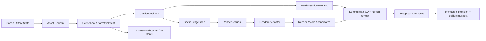

# Static production architecture v0

This is the target source-of-truth boundary, not a claim that every component already exists.

## Boundaries

- **Intent:** `SceneBeat`, `ComicPanelPlan`, spatial mode, and `HardAssertionManifest` describe what the story/panel requires before rendering.
- **Execution:** `RenderProfile`, `RenderRequest`, `RenderRecord`, machine/runtime state, and generated files describe what a renderer actually did.
- **Acceptance:** an accepted panel is a selected immutable revision, not a filename overwritten in an output folder.
- **Spatial authority:** canonical Blender/set assets will be authoritative for grounded panels. The existing plate calibration and compositing system is retained as a legacy staging method; it is not a substitute for canonical 3D.
- **Comic versus animation:** shared canon/assets/narrative intent are reusable; panel direction and animated-shot direction remain separate records.

## v0 implementation order

1. Wrap the existing local Anima/Comfy renderer as `baseline_legacy` and record provenance without altering its graph behavior.
2. Resolve the frozen semantic gauntlet into baseline requests and version the resulting adapter-specific `BenchmarkCaseBundle v1`.
3. Add only the fields the first measured runs require; grow schemas from real failures and repairs.
4. Keep QA deterministic/human-led until QA sensors are calibrated with no-change controls and injections.

## First linked production records

`production/canon/`, `production/assets/`, `production/scene-beats/`, `production/comic/`, and `production/editions/` now contain a deliberately narrow CH01 record set. `src/north_garden/validate_production_records.py` verifies story-state links, comic-only plan boundaries, declared spatial modes, asset references, and immutable selected-panel hashes. It is a growth point for evidence, not a claim that a future `AnimationShotPlan` schema already exists.

The original CH01 import is preserved as v1 evidence. Its successor v2 plan separates stable `panel_id` values from `plan_revision_id`; `production/comic/panel-revisions/` then records immutable artwork revisions, and edition 002 selects revision IDs rather than treating a filename or plan ID as the revision. This is the panel-addressable correction path required for future chapter production.

## Narrative development boundary

`research/development/` may hold reviewable exploratory chapter scripts and
coverage studies. It is deliberately outside the current production authority:
a development script is not a StoryState, ComicPanelPlan, render request, or
animation shot. Promotion requires a new owner decision using
`production/templates/narrative-development-promotion-decision-template.json`.
Only that decision may authorize creation of new current StoryState → Asset
Registry → SceneBeat → ComicPanelPlan → HardAssertionManifest records. A later
renderer run and human review still create their own RenderRecord and immutable
revision/edition evidence; narrative approval never implies art acceptance or
commercial clearance.

## Current spatial-stage contract

`production/stages/kitchen-table-spatial-contract-v1.json` is the first renderer-agnostic bridge from a comic plan to a spatial authority. It carries calibrated camera/horizon, occluder, anchor, and no-contact constraints while explicitly marking the current room plate as legacy 2D reference rather than canonical 3D. Renderer adapters may consume it as a geometry proxy or reference control; they may not upgrade it to final-art, identity, or animation-shot authority.

`assets/stages/kitchen-table-stage-v1.obj` is a portable primitive canonical-geometry bootstrap. It carries only shared room/table/anchor/camera-line geometry; its manifest requires a later pinned Blender import/open calibration before anyone calls it canonical production-stage evidence.

`src/north_garden/resolve_spatial_stage.py` resolves grounded `ComicPanelPlan` assignments into `production/stages/resolved/` as adapter-neutral comic intent. The output is expressly not renderer provenance and contains no animation-shot plan.
