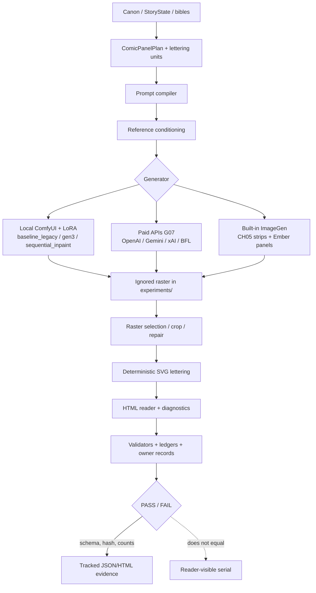

# Technical audit draft — generation and validation pipeline

Access date: 2026-09-06  
Worktree: `C:\AgentWorkspaces\anime-pipeline-total-review-20260906-211925`  
Source commit: `99cb5e9e37c211965a01213a6f7af7103aee8cf3`  
Role: Generation and Pipeline Engineer  
Art scoring: not performed. Visual quality is out of scope except where a validator claims to measure it.

This review's direct paid spend is **$0**. No ComfyUI start, no model download, no asset upload. Historical spend is quoted from existing ledgers only.

Companion matrix: [`validation-map.json`](validation-map.json).

---

## 1. What this worktree can and cannot execute

| Path | In this worktree | Notes |
| --- | --- | --- |
| `src/north_garden/` | 603 Python modules (317 `validate_*`, 125 `compile_*`, 61 `build_*`) | Tracked production/research code |
| `src/reimaginings/ember_lattice/` | Volume + premium-rd builders | Tracked |
| `production/` | Plans, manifests, Ember JSON, SVG/HTML under `docs/` | Tracked metadata and lettering overlays |
| `experiments/` | **Absent.** Gitignored. `git ls-files experiments` = 0 | Rasters, review packets, RenderRecords, bakeoff outputs live only on machines that already generated them |
| `garden/` | **Absent** | Untracked sibling scripts at `C:\AgentWorkspaces\anime-pipeline\garden\` |
| `ComfyUI/` | **Absent** (gitignored) | Local renderer cannot run here |
| `batch_generate.py`, `trainer/` | **Absent** | Sibling Lion Cub tools, not North Garden |

A clean checkout of this branch can compile prompts, re-author Ember lettering SVG, and re-run many JSON schema/hash validators **until those validators open a raster**. It cannot reproduce a panel, a sequence strip, a contact sheet, or a phone reader that depends on `experiments/`.

Sibling raster locations (read-only, not copied): Ember volume sources exist under `C:\AgentWorkspaces\anime-pipeline-litrpg-manhwa-20260904-001211\experiments\reimaginings\ember-lattice\` (264 PNG/JPG counted on this machine). CH05 review-packet rasters are not present in this worktree.

---

## 2. Pipeline map

There is not one pipeline. There are at least six execution families that share vocabulary (`ComicPanelPlan`, SHA-256, `REVIEWED_PASS`) and do not share a renderer.

### 2.1 Prompt compilation

**North Garden CH05 (per-candidate and per-strip).**  
`src/north_garden/build_ch05_overnight_prompts.py` concatenates use-case, beat, composition, three identity-anchor rules, hair/wardrobe contracts from `production/comic/continuity/ch05-fictional-adult-visual-profile-r1.json`, lettering-safe-zone coordinates, and a long avoid-list. Cast membership is translated to a single English sentence (`exactly two…` / `only Soren` / `only Sigrid` / `no people`). The compiler explicitly warns that `visible_adult_cast` array order is **not** staging order (`compile_ch05_character_assertions_and_prompt_lint.py`).

Complete-chapter arms (`compile_ch05_complete_chapter_premium_cel_prompt_manifest.py` and siblings) take 11 sequence prompts, not 50 panel prompts. They splice a style block over the base `Style/medium:` line and append **cross-panel semantic gate phrases** from `compile_ch05_cross_panel_semantic_gates.py`. Those phrases are required to appear in `prompt_text` (`validate_ch05_cross_panel_semantic_gates.py`). They are not required to appear in pixels.

**Ember volume.**  
`src/reimaginings/ember_lattice/author_volume.py` builds one prompt per panel from beat prose, a rotating camera list (`CAMERA_ACTION` / `CAMERA_QUIET` indexed by `(order + chapter) % n`), character contracts, a monster contract if a name token is in the beat, a 4-reference cap, and a large `STYLE_BLOCK`. Lettering reservations are six named slots (`tl/tr/tc/bl/br/bc`). SFX on action panels cycle `KRAK/THOOM/KLANG/SHNK`. Named subjects are inferred by substring match of character names in the beat (`named_subjects`).

**G07 bakeoff.**  
`src/north_garden/openai_gpt_image2_bakeoff.py` `prompt_for()` is a fictional tile-proxy prompt. It does not compile story panels.

**Legacy.**  
`src/north_garden/baseline_legacy.py` `prompt_for()` concatenates a manhwa style prefix, gauntlet description, trigger words `s0rn`/`sgrd`, and left/right area boxes. It states the translation is lossy and not grounded-stage evidence.

**Sibling Lion Cub (not a comic route).**  
`C:\AgentWorkspaces\anime-pipeline\batch_generate.py` compiles pose × style prompts with IP-Adapter identity from real plush photos. Out of North Garden / Ember serial scope.

Error introduced here: the compiler turns story into a long English contract the model can ignore. Sequence-strip compilation (CH05) further asks one image to contain 3–5 distinct beats. Camera/SFX/slot rotation looks like direction while being modular arithmetic.

### 2.2 Reference conditioning

CH05 allowlists **exactly three** hash-pinned fictional-adult PNGs (`p050_dual_identity_action`, `p040_sigrid_face`, `p036_composition_only`) in `validate_ch05_complete_chapter.py` `ALLOWLIST`. P036 is composition-only because its hair roles conflict; prompts must contain `never copy its dark-haired Soren or blond Sigrid`. Ledger r37 records 92 authorized reference uses across five complete-chapter style arms, still only **3 unique hashes**.

Ember `references_for()` always starts with `ref-style-b`, adds character sheets, then a monster or zone sheet, capped at four. Crowded action drops the zone sheet in favor of the creature (`author_volume.py`).

G07 BFL is restricted to two public controls (`public-controls/g07a-*.png`). Paid OpenAI/Gemini/xAI bakeoff adapters consume those same fictional controls.

Local ComfyUI uses **LoRAs** (`soren_v1.safetensors`, `sigrid_v1.safetensors` at 0.55) plus regional **text** masks. `C:\AgentWorkspaces\anime-pipeline\garden\gen3.py` documents that LoRA weights remain global: “the model is not regional.” `ConditioningSetAreaPercentage` is unused because Anima’s extra latent axis crashes it; masks are used instead.

Sibling `trainer/` trains a Lion Cub LoRA from real photos against `novaAnimeXL_ilV190`, then `batch_generate.py` uses IP-Adapter Plus SDXL. That identity path is the opposite of CH05/Ember (prompt contracts + a few generated stills).

Error introduced here: three CH05 stills are asked to lock two adults across 50 panels and five style arms. Ember’s four-image cap plus style-sheet blending is a known face-blender risk (commented in `author_volume.py`). Legacy LoRAs cannot be regionally masked. None of these routes have a production identity encoder for the serial casts.

### 2.3 Local ComfyUI / LoRA routes

Present only as wrappers in this worktree; graphs live in the sibling `garden/` tree.

| Script | Role |
| --- | --- |
| `garden/gen.py` | Full-frame Anima graph (`anima-aesthetic-v1.1`, Qwen CLIP/VAE, ~34–42 steps) |
| `garden/gen3.py` | Regional text masks + global LoRAs |
| `garden/panelcomp.py` | Generate each lead alone, key off a grey plate (`voidfx.mask_from_plate`), grade, contact shadow, 1px ink edge |
| `garden/make_page01.py`–`make_page03.py` | Page assembly |
| `src/north_garden/baseline_legacy.py` | Provenance wrapper; dry-run or `import gen3` |
| `src/north_garden/sequential_inpaint.py` | Two-pass inpaint, one LoRA at a time, collateral-change measurement |
| `src/north_garden/legacy_duo3.py` | Three-panel CH03 demonstration on the same graph |
| `src/north_garden/illustrious_xl_v2_*` | Local SDXL / Xinsir research arms |
| `src/north_garden/controlled_actor_capture.py` | Actor plates for mattes |

Historical local ledger (`docs/research/production-time-cost-ledger.md`): 79 renderer generations, 2,568.448 s, **0 production accepted outputs**. Stage A baseline: 24 gens, 903.790 s, 0 accepted.

This isolated worktree cannot run these routes: `garden/` and `ComfyUI/` are missing.

### 2.4 In-product image generation

The production-scale comic routes in 2026-09 use **OpenAI built-in ImageGen in Codex**, not the G07 paid `gpt-image-2` API.

Registration:

- CH05 overnight: `register_ch05_overnight_candidate.py` copies from `%USERPROFILE%\.codex\generated_images` into `experiments/`, records `model/endpoint/request_id/usage/cost_usd/seed = null`.
- Ember: `record_generated_panel.py` copies into `experiments/reimaginings/ember-lattice/...`, writes `model: "imagegen-default"`, `endpoint: "built-in-image_gen"`, `usage: null`, `monetary_cost: 0`, `seed: null`. The model string is a local alias, not a provider snapshot.

CH05 complete-chapter execution (`compile_ch05_complete_chapter_premium_cel_execution_manifest.py`) binds 11 sequence-strip PNGs by SHA-256, dimensions, and byte size. Timing is mixed: some rows have individual `elapsed`, most only a parallel batch wall (e.g. 239.1 s for two strips). Unavailable fields are explicit nulls.

Ledger quote (`docs/research/evidence/ch05-production-cost-ledger-r37.json`):

- `state`: `DISABLED_NO_PRODUCTION_SPEND_OR_UPLOAD_AUTHORITY`
- `committed_actual_cost_usd`: `"0.000000"`
- five complete-chapter style arms: 55 sequence tool calls, 55 rasters, 250 crops, 92 reference uses, 3 unique reference hashes
- `model`, `endpoint`, `provider_request_ids`, `usage`, `monetary_cost_usd`, `deterministic_seed`: **null**
- `direct_paid_api_or_cloud_spend_usd`: `"0.000000"`
- `timing_combination_status`: `PROHIBITED_INCOMPARABLE_SCOPES`

G07 paid API (historical, not this review): `docs/research/evidence/g07-bakeoff-cost-ledger-r1.json` `committed_actual_cost_usd` `"1.057377"`, held `"0.000000"`. OpenAI costs are usage-rate estimates (`cost_reconciliation_method`: `usage_rate_reconciliation_estimate`). First OpenAI attempt released at TLS handshake with actual spend $0.

Ember volume generation-requests pin `monetary_cost: 0` even though product cost is undisclosed. That zero is an accounting convention, not a measured invoice.

### 2.5 Raster selection

CH05 does not generate 50 panels. It generates **11 vertical strips**, then crops.

1. Gutter detection: `compile_ch05_complete_chapter_alt_graphic_crop_manifest.py` `separator_clusters()` treats a row as a gutter if >72% of pixels are >245 or <15. Manual overrides exist per arm (flat-gouache has one; premium-cel r1 has none).
2. Split: `split_ch05_sequence_strips.py` hash-checks source strip, writes deterministic PNG crops, refuses to overwrite non-identical derivatives.
3. Assembly: `compile_ch05_complete_chapter_assembly.py` assigns target widths from motion/cast (680–1040 px) and gutters (64–120 px) onto a 1200-wide scroll.
4. Agent triage: `compile_ch05_complete_chapter_agent_triage.py` does **not** look at pixels. It copies a hardcoded `WARNINGS` dict and marks every other panel `PASS` on role, hair, wardrobe, lettering, and phone checks.

Ember selects 224 `REVIEWED_PASS` sources plus one preserved diagnostic (`audit_volume.py`). CH01 P001–P016 reuse owner-approved pilot rasters (`author_volume.py`). Chapter-level `mark_art_review.py` flips every pending row in a chapter to `REVIEWED_PASS` with one notes string.

Premium-rd maps each panel’s `variants` to workflow assets and requires hash-distinct variants (`premium_rd/model.py`). Active variant must be `REVIEWED_PASS`.

Error amplified here: a strip that fails one beat still contributes four other crops. Gutter mis-detects become wrong panel bounds. Batch `REVIEWED_PASS` converts a contact-sheet glance into 24 passing rows.

### 2.6 Repair

| Route | Mechanism | What it proves |
| --- | --- | --- |
| Ember CH03 P007 | `prepare_panel_repair.py` moves landscape fail to diagnostics, inserts r2 with an extra tall-9:16 sentence | Orientation class only; one allowed localized retry |
| Ember non-targets | `verify_repair_snapshot.py` rehashes every non-target output | Other files unchanged; not that the retry is good art |
| CH05 targeted | `apply_ch05_complete_chapter_repairs.py` swaps hash-pinned crops into assembly r2–r6 | Bytes replaced; visual class is a label (`repair_class`) |
| CH05 P036 mask research | 16 px inward cosine, topology controls, selector r1/r2 | Abstract compositor mechanics; **0** approved bases/masks/uploads |
| Premium-rd | `failures[]` with frozen variables, repaired asset, non-target hashes | Schema of a repair; quality is rubric-authored |
| Premium-rd clean-art | `editorial.py` `_clean_plate()` blends a 3×3 median filter | Noise metric can be lowered without changing drawing |
| Legacy | `panelcomp.py` / sequential inpaint | Isolation experiments, 0 accepted |
| G07 | Submission journal + budget hold; unknown outcome blocks retry | Transport recovery, not art recovery |

`comic_input_gate.py` is fail-closed for **production** repair: approved base raster, timed human minutes > 0, `accepted is True`, fictional-adults-only, no LoRA output as base. Real CH05 still has 0 approved bases. Repair research and complete-chapter “repairs” are therefore different systems with the same word.

### 2.7 Deterministic SVG composition

Ember volume: `build_volume.py` `render_svg()` sizes overlays from the source raster, draws balloons/captions/UI/SFX, and writes SVG that **embeds** the raster via `image href`. HTML readers instead use a **layered stack** (`layered_panel`) because, as `premium_rd/render.py` notes, browsers suppress nested SVG-as-image resources. If the PNG is missing, the SVG still parses; the reader sees a broken image.

If copy overflows the authored box, `dialogue_svg` / `caption_svg` / `system_svg` **expand the box** toward mid-panel (`needed > bh` → grow to 0.48/0.52). `audit_volume.py` repeats the same expansion, then tests fit against the **effective** box. Overflow is absorbed into geometry rather than failed.

Premium-rd: `render.py` `_lettering()` plus diagnostic modes (safe-zone, collision, density, noise). Strict editorial (`LetteringPlan/2.0`) checks balloon area ≤15%, total ≤25%, ≤2 balloons, ≤28 spoken words, phone type ≥14/12 px, units inside declared negative space, no overlap with protected zones (`premium_rd/model.py`). Protected zones themselves are **heuristic rectangles** from focal box fractions (`editorial.py` `_protected_zones`), not detected faces/hands.

CH05 lettering overlays (`build_ch05_lettering_overlay.py`, complete-chapter lettered reports) are review sheets, not a shipped SVG lettering system for the 50-panel draft. Early CH05 smoke lettering uses Pillow default font on raster cards.

Sibling Borrowed Down / City pipelines letter with Pillow onto assembled rasters (`pipeline.py` in those worktrees), not SVG overlays.

### 2.8 Validation and build architecture

North Garden validation is an **append-only lattice of hash-pinned JSON**. Typical validator:

1. Load tracked evidence.
2. Assert record_type, schema_version, counts, SHA-256 of inputs.
3. Optionally run a live subprocess suite.
4. Apply synthetic mutations to a dict and require they fail.
5. Print `0 failures, 0 warnings`.

Examples: `validate_production_records.py`, `validate_hardening_release.py` (44 core + 8 extensions), `validate_ch05_complete_chapter.py`, 37 `validate_ch05_production_cost_ledger_rN.py` files.

Ember volume: `audit_volume.py` writes `volume-validation.json`. The **tracked** copy is `PASS` with 0 errors, 224 PASS / 1 diagnostic. That file was produced when rasters existed. Live re-run in this checkout would error on missing sources.

Premium-rd: `audit.py` `audit_bundle()` ANDs schema validation, HTML/SVG link integrity, build-ledger reconciliation, JSON parse, and `unresolved_hard_failures == 0`. Link misses are **errors**, unlike volume HTML hrefs which are **warnings**.

Unit tests: essentially one suite, `src/reimaginings/ember_lattice/premium_rd/tests/test_premium_rd.py`, on synthetic fixtures with uniform rubric scores (4.2 vs 3.1). It tests machinery, not art.

Build: Ember `build_volume.py` / premium-rd `render.py` `build_site()` emit HTML, SVG overlays, contact sheets, `build-ledger.json`. Contact sheets require source PNGs.

---

## 3. Where error is introduced, hidden, amplified, or only documented

### Introduced (the visible serial is wrong because this stage made it)

1. **Sequence-strip generation (CH05).** One ImageGen call is asked to hold 3–5 causal beats, gutters, and lettering air. Cropping cannot restore a beat that was never drawn. Files: `compile_ch05_complete_chapter_*_prompt_manifest.py`, `compile_ch05_complete_chapter_*_execution_manifest.py`.
2. **Lossy prompt compilers.** Gauntlet → gen3 (`baseline_legacy.py`); beat substring → subjects (`author_volume.py`); six balloon slots; camera modulo; SFX cycle; 4-ref cap.
3. **Global LoRAs with regional text** (`garden/gen3.py`). Dual-character blend is an architectural error, not a sampling accident. `panelcomp.py` exists because this failed.
4. **Reference under-conditioning.** Three CH05 stills, including one identity-conflicting composition ref, reused 92 times.
5. **Nondeterministic generator with `seed: null`.** Built-in ImageGen cannot be rerun to the same bytes. Ember records `reproducible: false`.
6. **Heuristic protected zones and density labels.** Geometric boxes and `low/moderate/high` enums are authored, then later “validated” against themselves.

### Hidden (failure exists; the system reports PASS)

1. **Chapter-batch visual review.** `mark_art_review.py` requires N pending rows and writes `REVIEWED_PASS` for all. One notes string covers 24 panels.
2. **Hardcoded agent triage.** `compile_ch05_complete_chapter_agent_triage.py` sets `fail: 0` by construction; hair/wardrobe/role_order are `PASS` unless the panel id is in `WARNINGS`.
3. **Copied continuity contracts.** `validate_ch05_complete_chapter.py` checks `continuity.hair == HAIR` dict equality, not pixels.
4. **Prompt substring gates.** `validate_ch05_cross_panel_semantic_gates.py` and character prompt lint pass if English phrases exist in `prompt_text`.
5. **Lettering fit after box growth.** `audit_volume.py` expands boxes then tests the expanded box.
6. **HTML missing rasters as warnings.** Volume review hrefs that 404 become `warnings`, and `status` is still `PASS` if `errors` is empty. Tracked `volume-validation.json` has `"WARN": 0` from a run with rasters present.
7. **Tracked PASS JSON without rasters.** `production/reimaginings/ember-lattice/volume/volume-validation.json` is git-tracked `PASS`. `experiments/` is gitignored. A reader of git state sees PASS; a reader of HTML sees broken images.
8. **Ember `model: "imagegen-default"`** fills a field that CH05 honestly nulls.
9. **`write_phase_b_audits.py`** emits markdown `PASS` findings after checking only that `review_status` is `REVIEWED_PASS` or diagnostic. Complexion, fight causality, and phone occlusion are not measured.
10. **CH02 archival review** (`validate_production_records.py`): `human_review_status == not_yet_performed` **and** `all(value == 'pass' for value in panel['assertions'].values())`. Assertions can pass without a human.

### Amplified (a small generator error becomes a chapter error)

1. **Strip crop.** One bad gutter or one fused beat becomes several wrong panels.
2. **Style-arm multiplication.** Five CH05 arms × 11 strips = 55 gens from the same three refs and same gate phrases. Failures rhyme across arms.
3. **Median-filter “repair”.** `_clean_plate()` can pass clean-art metrics while softening actual linework; the metric then certifies the blur.
4. **System-state UI overlay.** `author_system_state.py` arithmetic is independent of whether the SVG Ledger block is readable or attached to the correct beat. A PASS ledger with wrong art **looks** like a working LitRPG.
5. **Release-gate count inflation.** `validate_hardening_release.py` and r2–r5 successors treat “44/44 local checks” as a ship signal. The checks are governance. GOAL.md already records 0/50 accepted.

### Merely documented (honest, non-gating)

1. `unavailable_fields` arrays and `REQUIRED_SERVICE_FIELDS` null checks (`validate_ch05_complete_chapter.py`).
2. `limitations[]` on manifests; ADR boundaries quoted in GOAL.md (compiler evidence ≠ visual continuity).
3. `chapter_lint.py` marks balloon geometry `not_assessable` and duplicate phash `advisory` / `UNCALIBRATED`.
4. `analyze_ch05_continuity_style_density.py` states identity is not measured.
5. `comic_input_gate.py` refusing synthetic fixtures as approvable.
6. Ember `owner_approval: PENDING`, `commercial_clearance: false`, `reproducible: false` on every generation request.
7. `.gitignore` comment: experiment hashes may be referenced while files remain local.
8. Browser QA scope note: decode ≠ seed-reproducible licensed art (`docs/reimaginings/ember-lattice/premium-rd/browser-qa.md`).

The documentation is unusually precise. It does not stop PASS from being the number a later agent or owner skims.

---

## 4. Maintainability

**Strengths.** Fail-closed path hygiene (`safe_relative_path`, gitignore checks for generated art). Intent/execution/acceptance split in `docs/architecture/overview.md` is coherent. Append-only ledgers and mutation tests make silent promotion of acceptance/cost hard. Ember premium-rd is a relatively clean package (`core.py`, `model.py`, `render.py`, `audit.py`, tests).

**Failures.**

- **File explosion as process.** 317 validators, 43 cost-ledger scripts, owner-review-index r1–r9, overnight release gates r1–r11, production-manifest r1–r6. Each milestone copies a validator that pins the previous hash. New engineers cannot find the live gate.
- **Duplicated prompt/crop/execution compilers** per style arm (premium-cel, alt-graphic, clear-line-watercolor, flat-gouache, reduced-palette). Same 11 ranges, different STYLE strings.
- **Two repair vocabularies** (P036 mask research vs complete-chapter crop swap vs Ember localized retry vs premium-rd `failures[]`).
- **Untracked sibling graphs.** `baseline_legacy.py` `sys.path.insert(garden)` — garden is not in this branch.
- **Windows lock** (`msvcrt` in `record_generated_panel.py`).
- **Tests do not cover North Garden.** One premium-rd unittest file. CH05 “self-tests” are in-process dict mutations, not pytest.

Maintainability score for *governance records*: high. For *shipping a serial*: low. The codebase is optimized to prove that it did not spend money or accept a panel, not to change a panel cheaply.

---

## 5. Throughput

Quoted, not invented.

| Work | Volume | Time | Accepted |
| --- | --- | --- | --- |
| Local ComfyUI research to 2026-09-01 | 79 gens | 2568.448 s | 0 |
| G07 paid bakeoff | 16 candidates + 1 paid 403 | 308.894 s provider time | 0 |
| CH05 overnight ImageGen | 20 candidates | 919.389 s | 0 |
| CH05 cadence-hardening | 6 | 310.669 s | 0 |
| Future LitRPG concept trio | 3 | 154.978 s | n/a (non-canon) |
| CH05 premium-cel 11 strips | 11 tool calls | overlap-adjusted 1234.0 s wall | 0 |
| Five CH05 style arms | 55 strips | incomparable scopes; do not sum | 0 |
| Ember 224 new panels | per-request seconds summed in volume HTML | `reproducible: false` | owner volume acceptance still open |
| Human review minutes | — | **null everywhere checked** | — |

Generator throughput is adequate for a research chapter (tens of minutes to a few hours per 50-panel arm). The binding constraint is **unmeasured human minutes** plus **re-generation cost of strip architecture** (changing P036 means regenerating a 5-panel strip or running a one-off repair).

Validation throughput is high and largely idle: hundreds of scripts hashing JSON. That does not increase panel/hour.

Ember per-panel generation is slower wall-clock than CH05 strips but locally repairable. CH05 strips are faster per *panel crop* and more expensive per *story correction*.

---

## 6. Reproducibility

| Claim | Reality |
| --- | --- |
| Prompt SHA-256 | Reproducible. Compilers are deterministic. |
| SVG lettering | Reproducible **given the same raster dimensions**. Missing raster → SVG with a dead href. |
| Built-in ImageGen pixels | **Not reproducible.** `seed: null`, model snapshot unknown. |
| Paid G07 OpenAI | Model id recorded (`gpt-image-2-2026-04-21`); still sampling-nondeterministic; cost estimated. |
| Local ComfyUI | Reproducible in principle (seed, hashes of UNET/CLIP/VAE/LoRA, comfy commit). **Not in this worktree.** ComfyUI gitignored; garden untracked. |
| experiments/ artifacts | Gitignored. This checkout has **no** `experiments/` directory. Tracked JSON points at missing files. |
| Volume validation PASS | Tracked `volume-validation.json` is a snapshot, not a live proof. |
| Premium-rd site | `build-ledger.json` would fail hash/size checks if regenerated without the same rasters. |
| CH05 complete-chapter validator | Requires rasters to exist, be PNG, match SHA, **and** be gitignored. Clean checkout: **false fail**. Dirty machine with rasters: can pass without reader-quality art. |

Reproducibility of *records* is excellent. Reproducibility of *pictures* is not a property of the current production route.

---

## 7. Failure recovery

**Transport / money / authority — strong.**  
`submission_journal.py`: pre-submit abort releases; post-boundary unknown retains hold and blocks retry. `bakeoff_budget.py` / `production_budget.py` domain-separate G07 vs CH05. `comic_input_gate.py` blocks unapproved bases. Hardening validators reject fabricated cost/acceptance.

**Visual / story — weak.**

- Ember: one orientation hard-fail class with a preserved diagnostic. No second-fail policy in code for identity, hands, or geography. `mark_art_review.py` cannot record mixed PASS/FAIL inside a chapter without unexpected-status abort.
- CH05: repair is “replace this crop with another generated file.” No mask compositor is wired to the complete-chapter arm. P036 16 px policy is research-only (four root blockers remain).
- Agent triage improves WARN counts by editing the warning dict when a new repair manifest appears — the scoreboard is the code.
- Built-in ImageGen failure is “call again,” with no seed and no request id that is a provider id (`tool_service_execution_id_is_provider_request_id: false`).

Recovery is optimized to **not pretend a failure was accepted**, not to **fix the page**.

---

## 8. Spend and unknown provider fields

**This review:** direct paid spend **$0**. No provider calls.

**Quoted historical G07** (`docs/research/evidence/g07-bakeoff-cost-ledger-r1.json`):

- `approved_aggregate_cap_usd`: `"100.000000"`
- `committed_actual_cost_usd`: `"1.057377"`
- `held_reservations_usd`: `"0.000000"`
- `available_usd`: `"98.942623"`
- First OpenAI reservation `outcome`: `not_submitted:tls_handshake_failed_before_http_submission`, `actual_cost_usd`: null

**Quoted CH05 production ledger r37:**

- `committed_actual_cost_usd`: `"0.000000"`
- `current_revision_activity.paid_spend_usd`: `"0.000000"`
- `human_review_minutes`: null
- `accepted` / `rights_cleared` / `commercially_cleared` / `exact_production_base`: 0
- Built-in `monetary_cost_usd`: **null** (not zero). Cumulative arms still print `direct_paid_api_or_cloud_spend_usd: "0.000000"` for paid APIs only.

**Unknown / null provider fields (do not invent):**

| Field | G07 OpenAI API | CH05 built-in ImageGen | Ember volume recorder |
| --- | --- | --- | --- |
| model | `gpt-image-2-2026-04-21` | `null` | `"imagegen-default"` (local alias) |
| endpoint | `https://api.openai.com/v1/images/edits` | `null` | `"built-in-image_gen"` |
| provider_request_id | present on committed rows | `null` (Codex exec id is not this) | Codex `exec-…` stem, mislabeled |
| usage | token object on OpenAI rows | `null` | `null` |
| monetary_cost | estimated or exact per arm | `null` | `0` (convention) |
| seed | n/a / not in bakeoff records as a frozen sampler seed | `null` | `null` |

Invoice-level confirmation for estimated G07 arms remains a stated limitation in `docs/research/production-time-cost-ledger.md`. Local electricity is unmeasured.

---

## 9. Goodharted metrics

Passing because the pipeline optimizes the test while the visible result can remain unsatisfying. Exact files:

| Metric | File | How it is gamed |
| --- | --- | --- |
| `0 failures, 0 warnings` | `validate_production_records.py`, `validate_hardening_release.py`, dozens of `validate_ch05_*` | The test is “JSON still matches last night’s JSON.” |
| Prompt phrase presence | `validate_ch05_cross_panel_semantic_gates.py`, `compile_ch05_character_assertions_and_prompt_lint.py` | Put the sentence in the prompt; pixels free. |
| Continuity hair/wardrobe | `validate_ch05_complete_chapter.py` | Dict copied onto every panel row. |
| Agent triage PASS/WARN | `compile_ch05_complete_chapter_agent_triage.py` | Edit `WARNINGS`; `fail` stays 0. |
| Chapter `REVIEWED_PASS` | `mark_art_review.py` | One notes string → N passes. |
| Phase B complexion/causality PASS | `write_phase_b_audits.py` | Hardcoded findings after status check. |
| Density 159/60/21 | `author_volume.py` + `audit_volume.py` | Labels assigned by order sets, then counted. |
| Entropy / luma / edge / high-frequency | `audit_volume.py`; City `pipeline.py` | Busy noise passes; quiet graphic panels can false-fail; not identity. |
| Clean-art median_delta | `premium_rd/editorial.py` `_noise_metrics` / `_clean_plate` | Blur until the number drops. |
| Phone type px | `audit_volume.py`, `premium_rd/model.py` | `font_scale * 390` is authored, not OCR’d from pixels. |
| Lettering IoU / fit | `audit_volume.py` | Expand box, then pass fit. |
| Protected-zone collision | `premium_rd/editorial.py` `_protected_zones` | Zones placed to miss lettering by construction. |
| Duplicate art | `audit_volume.py` exact SHA; `chapter_lint.py` phash advisory | Near-duplicates and strip-siblings pass exact-hash. |
| Action sequence ≥ 6 | `premium_rd/model.py` | Tag six panels `action_sequence: "action-a"`. |
| Scenario coverage checklist | `REQUIRED_SCENARIOS` | Assign scenario ids in the author template. |
| Rubric median / winner | `premium_rd/model.py` `rubric_summary` | Completeness of 0–5 numbers; tests use uniform 4.2. |
| Hard-failure unresolved count | `HARD_FAILURES` in `model.py` | Empty `hard_failures` arrays; status `REPAIRED`. |
| HTML decode 104/104 | `browser-qa.md` | Images loaded; craft not scored. |
| Volume validation PASS | tracked `volume-validation.json` | Snapshot from a machine that had rasters. |
| Cost $0 milestones | `compile_ch05_production_cost_ledger_r31.py`–`r37.py` | Appending “we did not call a provider” is not production fitness. |
| Mutation 18/18, 22/22, … | hardening / ledger validators | Proves the validator still rejects its own synthetic dicts. |
| System-state final Level 8, 295 XP, … | `author_system_state.py` `validate_collection` | Expected dict is written by the same script that produces the ledger. |
| Owner approval `pilot: APPROVED` | `production/reimaginings/ember-lattice/owner-approval.json` | Pilot style approval ≠ volume acceptance (`owner_approval: PENDING` on requests). |
| Gutter count == panel_count-1 | crop compilers | Strips can be drawn to create white bars so the detector succeeds. |

GOAL.md already says ADR-0027 limits hash-stable compiles to compiler evidence. The Goodhart failure is that later complete-chapter and Ember volume gates **look like** reader QA.

---

## 10. Sibling unique scripts (read-only)

**`C:\AgentWorkspaces\anime-pipeline\garden\`** (untracked): `gen.py`, `gen2.py`, `gen3.py`, `panelcomp.py`, `make_page01.py`–`make_page03.py`, `voidfx.py`, `canon.py`, `rooms_def.py`, `stage.py`, `facecrop.py`, `build.py`–`build14.py`, `cast.py`–`cast5.py`, `styles3.py`/`styles6.py`, LoRA train yamls. This is the only executable Anima path. Honest limitation of regional LoRAs is in `gen3.py`’s docstring.

**`C:\AgentWorkspaces\anime-pipeline\batch_generate.py`**: Lion Cub Comfy batch, ControlNet Union + IP-Adapter Plus on `novaAnimeXL_ilV190`. Not a webcomic compiler.

**`C:\AgentWorkspaces\anime-pipeline\trainer\`**: photo-prep → kohya LoRA. README states synthetic-then-LoRA was circular and failed; real photos broke the loop. That lesson was **not** transferred to CH05/Ember identity (still prompt + few generated refs).

**Borrowed Down** (`C:\AgentWorkspaces\anime-pipeline-reimagining-20260903\src\reimaginings\borrowed_down\pipeline.py`): 10×30 panels, 6 sequence prompts/chapter (5-cell grid), 24-word lettering cap, prompt-hash, no raster identity metrics in `validate_all()`.

**The City Keeps Oaths** (`...\the_city_keeps_oaths\pipeline.py`): 10×24, 8 sequences/chapter, density budget 16/5/3 with no adjacent highs, 4-reference cap, entropy/edge/high-frequency ceilings vs pilot class — same Goodhart class as Ember `audit_volume.py`. Cross-chapter `state_before == previous state_after` is string-list continuity, not Ember’s numeric ledger.

---

## 11. Assessment by production-fitness dimension (no art scores)

| Dimension | Finding |
| --- | --- |
| Repeatability | Prompt/SVG/JSON yes; pixels no on the live ImageGen route. |
| Editability | Ember per-panel + SVG overlay is editable in principle. CH05 strip architecture makes single-beat edits expensive. Premium-rd overlay is the best lettering edit path. |
| Art-directability | Style arms and STYLE_BLOCK are switches, not a director. Camera lists and balloon slots are not shot design. |
| Correction cost | High for CH05 (regenerate strip or ad-hoc repair). Medium for Ember (one panel + overlay). Mask compositor unused in production. |
| Identity control | Prompt contracts + 3–4 refs + optional LoRAs. No calibrated identity QA. Agent/chapter review is status, not measurement. |
| Throughput | Generator hours per chapter are fine; unmeasured human review is the unknown. Validator volume is overhead. |
| Human review load | Minutes null. Batch PASS reduces recorded load by not recording it. |
| Reproducibility | See §6. Clean checkout cannot show the comic. |
| Rights / provenance | Fail-closed documentation is strong; commercial_clearance false; G07 terms/BFL training-use boundary recorded. Built-in product terms are not snapshotted as a model id. |
| Maintainability | See §4. |

Causal reason the pipeline can be “green” while remaining below a professional serial bar: **the live generators are nondeterministic image models; the live tests mostly certify that the wrappers still wrap.** Error is introduced in compilation and generation, hidden in status fields and copied contracts, amplified by strip cropping and overlay-as-product, and documented in limitations that do not change the gate.

---

## 12. What to retain vs change (engineering only)

Retain: hash addressing, gitignore of generated art, unavailable-field nulls (CH05 style), journal/budget fail-closed, exact non-target repair snapshots, prompt-hash, ComicPanelPlan vs AnimationShotPlan nulls, owner non-promotion flags, mutation tests **as governance**, premium-rd link+ledger audit (errors, not warnings).

Modify: volume HTML missing assets must error; tracked validation JSON must not say PASS when rasters are absent; lettering audit must test authored box not expanded box; agent triage and mark_art_review must be per-panel and pixel-optional; semantic gates need a visual check or to stay labeled compiler-only in the **gate name**; density/entropy/phone-type cannot gate art; Ember `model` should be null if unknown; system-state expected finals should live in an independent spec, not the author script.

Remove or stop treating as fitness: per-revision cost-ledger validators that only append $0; release-gate “N/N checks” as a substitute for accepted panels; hardcoded Phase B PASS markdown; uniform rubric scores as architecture proof.

Next-pilot implication (not a visual score): if the owner wants a serial rather than a wrapper, generate **one panel per ComicPanelPlan**, keep SVG lettering, keep fail-closed money/identity policy, and put human minutes on the critical path with a status that cannot be batch-flipped. Strip generation and contact-sheet PASS are the two highest-leverage error amplifiers found in code.
