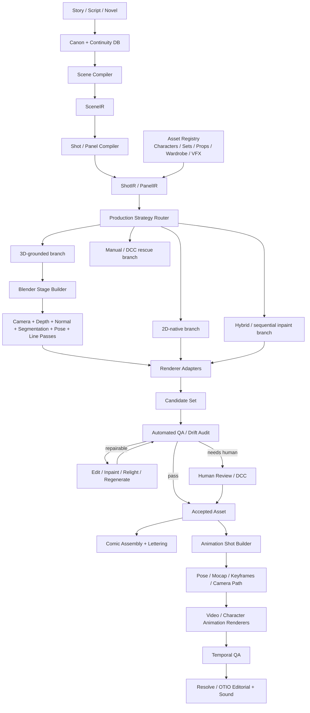

# Master Research & Architecture Brief
## A Model-Agnostic Pipeline for Consistent Webcomics → Storyboards → Anime

**Prepared:** 31 Aug 2026  
**Purpose:** Long-horizon research and engineering brief for a solo/very-small-team visual narrative production pipeline.  
**Starting point:** The 12-page *North Garden Pipeline Brief — Eight Months of Wrong Turns* supplied by the user.  
**Changed constraint:** The earlier “no new accounts / no unapproved spend” constraint is removed. Tool changes, subscriptions, cloud GPUs, asset purchases, specialist software, and paid APIs are allowed when they materially improve the system.  
**Still non-negotiable:** the project’s stated child-safety boundary remains; real-person adult likeness use remains consent-based and should be policy- and provenance-aware.

---

# 1. Executive recommendation

The project should stop being framed as “find the image model/workflow that can make a consistent 50–90 panel comic” and instead become a **Visual Narrative Compiler / Production Operating System**.

The central idea is:

> **Continuity, identity, geometry, canon, assets, shot state, revision history, and validation must exist outside the generative model. Models should be replaceable renderers and editors, not the memory or source of truth of the production.**

This is the architectural conclusion most strongly supported by both the original failure log and current 2026 research. The original report already discovered that prompt-only identity, globally applied LoRAs, separately composited figures, hand-derived perspective, mutable character-description strings, and “one pretty image at a time” all hit ceilings at chapter scale. Current long-form storytelling work such as **MangaFlow** independently arrives at a decomposed planning/grounding/layout/render/composition/lettering architecture, while **StoryBlender** makes continuity memory plus canonical 3D assets and engine-verified spatial feedback the core of multi-shot consistency.

The target architecture should therefore be capable of all of these, with no single one mandatory for every shot:

- text/story planning and canon management;
- reusable character, wardrobe, prop, power, and set assets;
- 3D scanning, generated 3D, purchased 3D, and manually/procedurally modeled 3D;
- canonical room/set geometry and camera blocking in Blender;
- 2D-native generation for expressive or simple shots;
- 3D-grounded generation for geometry-critical shots;
- local open-weight rendering;
- paid hosted image/edit/video models as optional renderer adapters;
- character LoRA/reference/identity methods without making any one method architectural;
- deterministic lettering and page assembly;
- automated continuity auditing and targeted repair;
- panel-by-panel revision lineage;
- storyboard/keyframe reuse for animation;
- character animation, mocap, sparse keyframe animation, video diffusion, compositing, editing, color, dialogue, music, and SFX;
- an “escape hatch” to conventional DCC/manual correction at every stage.

The long-term deliverable is not a particular ComfyUI graph. It is a **production graph whose render nodes can change as models improve**.

---

# 2. What the original brief established and what should change

## 2.1 Findings to preserve

The original report contains expensive, useful evidence and should not be discarded. Preserve these as engineering findings:

1. **The hard problem is volume with consistency**, not single-image quality.
2. **Prompt-only character design is insufficient** for recurring identities.
3. **Character-specific LoRAs can strongly assert identity**, so they remain valuable assets, even if not the final multi-character solution.
4. **Two globally active LoRAs can bleed or merge identities.**
5. **Text regionalization does not make globally patched LoRA weights regional.**
6. **Separate compositing helps identity but creates perspective, lighting, contact-shadow, edge, and collage ceilings.**
7. **Hand-derived perspective fixed symptoms but is the wrong source of geometric truth.**
8. **Character/canon strings need stable identifiers and timeline-aware variants**, rather than improvised prose from shot to shot.
9. **Programmatic lettering is an architectural strength.** It should remain deterministic, addressable, and reflowable.
10. **Panel-level repair and chapter-scale drift detection are essential** for production economics.
11. **The art style is not yet frozen**, so style-specific training should not be allowed to prematurely lock the architecture.
12. **The original Q10—honest economics—must be measured from actual chapter attempts**, not assumed from public anecdotes.

## 2.2 Findings to reinterpret

### “The 0.6B text encoder is the root cause”
For the Anima branch, this is a strong local diagnosis: a tag-oriented/small language encoder was a poor match for spatially compositional prose. It explains much of that model’s staging failure. It should **not** be promoted to the system-level root cause.

Modern image/edit models have much stronger semantic and multimodal conditioning. Even with better instruction following, however, a generative image model should not be the sole authority for exact camera, role binding, set topology, wardrobe state, prop persistence, or long-horizon continuity.

### “Per-region LoRA may be the single unlock”
Treat this as one experiment, not the expected architecture. Current multi-subject research (XVerse, UMO-family work, DiffSensei, reference-conditioned/edit models, sequential inpainting) suggests there are several competing identity-binding paradigms worth testing.

### “Set continuity might need an environment LoRA”
An environment LoRA can be tested as a renderer aid, but the default research hypothesis should become:

> **Recurring sets should have canonical spatial assets; image models should render or stylize the set, not invent its topology anew every panel.**

### “ComfyUI is the pipeline”
ComfyUI should remain a valuable inference engine and prototyping backend, but it should be behind an adapter interface. The compiler should also be able to call direct Python inference, commercial APIs, cloud Comfy, Blender, or future engines.

---

# 3. Mission statement and definitions of success

## 3.1 Long-term mission

Build a **model-agnostic, reproducible, deeply controllable visual storytelling production system** that can turn a canonical story into:

1. a consistent serialized webcomic at chapter scale;
2. editable cinematic storyboards and animatics;
3. short controlled animated scenes;
4. eventually full anime-style episodes or films;

while reusing the same story, asset, scene, shot, camera, continuity, and revision state across all outputs.

## 3.2 Webcomic production definition of done

A chapter-scale system should be considered production-qualified only when it can repeatedly produce a **50–90 panel chapter** that is:

- visually coherent;
- canonically correct;
- correct in character identity and role assignment;
- correct in wardrobe/time-state/props;
- spatially plausible in multi-character interactions;
- recognizable across recurring sets and reverse angles;
- individually editable by panel ID;
- automatically audited for common continuity failures;
- lettered and assembled programmatically;
- reproducible from stored metadata;
- measurable in total human minutes, GPU time, API cost, candidates rejected, and repair count.

## 3.3 Animation production definition of done

Do not define success as “a model generated a good 8-second clip.” The animation target is a shot-based production where:

- the same character and set assets used by the comic can seed the shot;
- the camera and action have explicit timing;
- poses or performance controls are stored;
- output clips are revisioned by shot ID;
- temporal identity and wardrobe remain consistent;
- adjacent shots cut together coherently;
- dialogue, SFX, music, and color are separated into editable production layers;
- final assembly can be conformed from a timeline without manual filename archaeology.

---

# 4. Architectural principles

## Principle A — Canon lives outside models
A model never “remembers” the production. Canon is a database/typed object graph.

## Principle B — Geometry has an authoritative representation
When exact blocking matters, camera and set geometry come from Blender/3D, not prose.

## Principle C — Model outputs are candidates, not truth
Every generation is a `RenderAttempt`; only an explicitly accepted candidate becomes the current panel/shot asset.

## Principle D — All important state is addressable by stable ID
`character:soren`, `wardrobe:soren_ch01_home`, `set:kitchen_v003`, `scene:ch01_sc004`, `shot:ch01_sc004_p034`, etc.

## Principle E — Every output has provenance
Store model/version, workflow hash, prompts, references, seed, control assets, code commit, runtime, cost, and policy/license status.

## Principle F — Repair is first-class
A good production system does not demand perfect first-pass generation. It makes isolated correction cheap and safe.

## Principle G — Human art tools are not a failure mode
Clip Studio, Blender, Resolve/Fusion, Harmony, etc. are production rescue paths. The system should make human correction fast rather than prohibit it.

## Principle H — Open and commercial models compete behind the same interfaces
Local Qwen/FLUX/Illustrious, a commercial API, or a new model next year should all be `RendererAdapter`s.

## Principle I — Comic and anime share a shot language
Animation should extend the static `ShotIR`, not restart from text prompts.

## Principle J — Production decisions are benchmark-driven
A new model gets promoted because it wins the project’s continuity gauntlet, not because examples look impressive online.

---

# 5. Proposed reference architecture



The crucial architectural distinction is between **production state** and **render implementation**.

---

# 6. The canonical data model

The original report’s Q9 (“panel-record architecture”) should become **Priority 0**, before more model tuning.

## 6.1 Core entities

```text
Project
  project_id
  policy_profile
  color_pipeline
  output_profiles

StoryEvent
  event_id
  timeline_position
  state_changes[]

Character
  character_id
  canonical_name
  role
  identity_assets[]
  physical_spec
  3d_proxy_asset
  voice_asset?     # later

CharacterState
  character_id
  validity_range
  wardrobe_id
  hair_state
  equipment[]
  injuries[]
  powers_state
  emotional_state
  notes

WardrobeAsset
PropAsset
PowerEffectAsset

SetAsset
  set_id
  canonical_blend_scene
  scan_reference?
  worldgen_reference?
  dimensions
  anchor_points[]
  lighting_variants[]
  camera_presets[]
  version

SceneIR
  scene_id
  story_events[]
  location/set
  characters + states
  time_of_day
  continuity_requirements
  narrative purpose

ShotIR / PanelIR
  shot_id
  scene_id
  shot_type
  narrative beat
  camera transform / lens / framing
  character blocking
  pose / expression intents
  depth order
  interactions
  props
  dialogue
  captions
  SFX
  lighting intent
  style profile
  required controls
  hard assertions[]
  soft preferences[]

RenderAttempt
  attempt_id
  shot_id
  strategy
  renderer_adapter
  model + exact version/hash
  workflow hash
  seed(s)
  prompts / structured conditioning
  reference asset IDs
  control-pass IDs
  start/end time
  local/cloud/API cost
  candidate files
  QA metrics
  failure tags

AcceptedShotAsset
  shot_id
  accepted_attempt
  accepted_file
  approval time
  revision lineage
  downstream dependencies
```

## 6.2 Assertions are important

A ShotIR should distinguish requirements such as:

```yaml
hard_assertions:
  - character.soren.present == true
  - character.grace.present == true
  - role_binding.left == soren
  - wardrobe.soren == ch01_home
  - prop.kitchen_lamp.count == 1
  - depth_order: [grace, kitchen_table, rear_wall]

soft_preferences:
  - expression.grace: amused
  - line_weight: medium
  - palette.temperature: warm
```

This lets QA decide what is a failed shot versus a merely imperfect aesthetic choice.

## 6.3 Revision lineage

Never overwrite `panel_034.png`.

Instead:

```text
shot ch01_sc04_p034
  attempt 001 -> rejected: identity_bleed
  attempt 002 -> rejected: wrong_depth
  attempt 003 -> accepted v1
  edit 004    -> accepted v2: expression repair
  letter v3   -> dialogue revision only
```

This is the basis for safe automation and chapter-scale change propagation.

---

# 7. 3D/world/set strategy — make it a core capability

The user explicitly wants the system to be able to generate/build Blender rooms and whatever else is needed. The architecture should support **four ways of acquiring canonical 3D**.

## 7.1 Real-location sets: scan → reconstruct → clean canonical proxy

For the real property/recurring physical locations:

1. Capture a systematic image/video/360/LiDAR dataset where practical.
2. Reconstruct a photogrammetry or Gaussian-splat reference.
3. Recover real-world scale from measurements or known anchors.
4. Use the reconstruction as a **visual survey/reference**, not automatically as production topology.
5. Build or clean a lower-complexity canonical Blender set with reliable floors, walls, doors, counters, tables, windows, collision, and anchor points.
6. Acquire/fabricate high-detail props separately.
7. Publish the set as a versioned asset.
8. Render image-model conditioning passes from arbitrary cameras.

Why: noisy scan geometry is excellent reference but poor production geometry. A simple, accurate room mesh is more valuable for pose, camera, contact, occlusion, and segmentation.

### Candidate capture/reconstruction research
- KIRI Engine / similar capture services for photogrammetry/3DGS experimentation.
- Nerfstudio / gsplat-style local workflows where privacy warrants local processing.
- Conventional photogrammetry where clean mesh reconstruction is preferable.

## 7.2 Fictional sets: world generation → art direction → canonical rebuild

World-generation systems should be treated as **concept/set accelerators**, not unquestioned source of truth.

### High-priority candidate: World Labs Marble
Current Marble can create worlds from text, image, multi-image, video, and 3D layout input; its Pro tier includes high-quality textured mesh export and commercial rights. Exported high-quality meshes are on the order of hundreds of thousands to ~1M triangles. The API provides generated world assets and collider/splat outputs.

Recommended experiment:

```text
written set brief
   -> Blender graybox / Chisel-style spatial sketch
   -> Marble world generation
   -> export mesh / panorama
   -> Blender cleanup + scale normalization
   -> replace or remodel structural surfaces
   -> lock canonical set
```

### High-priority open research: HY-World 2.0
Tencent’s 2026 HY-World 2.0 has open world-generation components for panorama → trajectory → expansion → composition into navigable 3D/3DGS/mesh. This is interesting for local/private future workflows, but should be benchmarked for compute and production cleanup cost.

## 7.3 Individual props/assets: AI 3D and purchased libraries

Use multiple acquisition routes:

### AI 3D candidates
- **Tripo API** — image/text/multiview generation, PBR, low-poly/mesh segmentation/editing workflows; API-friendly.
- **Meshy** — API and Blender-oriented asset generation; evaluate privacy, licensing, retopo, rigging, and throughput.
- **TRELLIS.2** — open image-to-3D with PBR output; H100-class benchmarks suggest cloud GPU is useful for high resolutions.
- **Hunyuan3D 2.1** — open PBR image-to-3D candidate.

### Purchased/procedural assets
- **Blendkit/BlenderKit-style libraries** for common furniture/materials.
- **KitBash3D/Cargo** for larger environment kits where appropriate.
- specialized marketplace assets when the purchase is cheaper than generation + cleanup.

**Rule:** no AI-generated/purchased model becomes canonical until its scale, topology, license, texture provenance, pivots, materials, collision needs, and coordinate conventions are checked.

## 7.4 Character proxies and production rigs

Static webcomic blocking does not need final 3D character art. It needs accurate silhouettes, heights, bones, hands, head direction, contact, and occlusion.

Recommended tiers:

### Tier 1 — simple reusable proxies
Rigify/basic Blender humanoids with per-character height and body proportions. Best first implementation.

### Tier 2 — Reallusion Character Creator 5 + iClone
Strong candidate if the project benefits from reusable digital doubles/rigged characters. Current CC5 supports production-ready human/stylized bases and a Blender bridge; Reallusion’s 2026 workflows use CC5 for identity/topology/rigging, iClone for performance, and Blender for final cinematography. This is worth a serious trial because the cost of rigging/facial systems manually can dwarf the license cost.

### Tier 3 — custom sculpt/rig
Use only where the art direction or anatomy cannot be represented with Tier 1/2.

### Motion tools for later animation
- **Cascadeur**: AI-assisted posing, inbetweening, physics-aware correction, mocap cleanup, retargeting.
- **Rokoko Vision/Studio**: video-to-motion, retargeting, Blender live integration; upgrade to hardware mocap only if the production demonstrates a need.
- **Mixamo**: useful free library/auto-rig baseline for humanoid motions, not a final studio motion system.

---

# 8. Blender’s role

Blender should be promoted from “possible staging experiment” to **the first authoritative spatial backend**.

Recommended production outputs from a blocked shot:

- camera transform + lens;
- object/character world transforms;
- depth map;
- normal map;
- character/object segmentation masks;
- cryptomatte/object IDs where useful;
- OpenPose/DWPose-style skeleton render;
- silhouette/line-art pass;
- flat-color role mask;
- shadow/contact guide;
- ambient/light direction guide;
- optional rough NPR/Grease Pencil storyboard render.

Blender 4.5 LTS is a sensible stable baseline. Grease Pencil is useful for storyboarding and 2D-on-3D corrections. Python automation is first-class and should be used to build sets/shots from `ShotIR` rather than manually reproducing scenes.

## 8.1 What to automate in Blender

- load canonical set asset;
- link/import character proxies;
- apply character state/height;
- set camera preset or calculated camera;
- apply pose/IK markers;
- position props;
- render all control passes;
- export thumbnail/storyboard;
- emit a machine-readable `stage_manifest.json`;
- optionally publish a `.blend` workfile/version.

## 8.2 3D need not dictate the final look

The output may still be a highly stylized 2D anime/webcomic image. The 3D layer is **ground truth for relationships**, not an aesthetic prison.

---

# 9. Static image renderer research program

Do not choose one “best model” up front. Build renderer adapters and execute a controlled bake-off.

## 9.1 Renderer family A — Qwen image/edit

High priority because current Qwen image/edit models provide:

- open weights in the Qwen-Image family;
- much stronger instruction semantics than the Anima branch;
- native ComfyUI workflows;
- editing and multi-image support;
- Qwen-Image-Edit-2511 specifically advertises improved character consistency, multi-person consistency, lower edit drift, LoRA integration, and stronger geometric reasoning;
- Qwen-Image-2512 provides a strong open text-to-image baseline;
- the project should also benchmark the newer Qwen-Image-2.0 line where weights/API availability and deployment fit the workflow.

Research paths:

1. reference-only identity;
2. multi-reference character fusion;
3. character LoRA + structural control;
4. scene render → edit/stylize;
5. sequential per-character inpainting;
6. identity re-assertion after a general edit;
7. novel-view/set continuation;
8. layer decomposition where supported.

## 9.2 Renderer family B — FLUX.2

High priority for a second architecture with a different conditioning stack. FLUX.2 supports multi-reference editing and has local/open variants plus commercial API variants. Current Comfy documentation describes multi-reference consistency and programmatic workflows; BFL’s API supports multiple image references.

Research paths:

- multi-reference identity + wardrobe + set refs;
- 3D-blockout image as layout reference;
- control/pose adherence;
- editing collateral damage;
- style retention versus identity retention;
- open-weight self-hosted vs API quality;
- licensing terms for commercial use and any synthetic-data/training rights.

## 9.3 Renderer family C — Illustrious/SDXL ecosystem

Keep this branch because the ecosystem remains valuable for:

- mature LoRA workflows;
- ControlNet;
- region/mask workflows;
- anime/manga community models;
- fast iteration at 24 GB VRAM.

But treat it as a **benchmark and specialist renderer**, not the assumed platform.

## 9.4 Multi-subject research engines

### XVerse
Explicitly designed for independent multi-subject identity/semantic control; the official repo supports 24 GB and lower-VRAM modes and includes a benchmark for single/dual/triple subjects. It should be tested against the project’s two-lead interaction shots.

### USO / UMO-family research
USO separates style and subject conditioning and has a consumer-GPU mode; its repository points to UMO as the multi-identity continuation. These are high-value research baselines for the project’s need to keep identity and visual style disentangled.

### DiffSensei
It is directly relevant because it targets customized manga with dynamic multi-character control and has a lower-memory configuration that can fit 24 GB for smaller/medium panels. Even if black-and-white manga is not the final look, the architecture and benchmark behavior matter.

### StoryDiffusion
Keep as a long-range consistency baseline. It is older than the 2026 image-edit stack but explicitly targets consistent comic sequences and multi-character generation.

## 9.5 Closed/API benchmark family

Closed models should be included when policy permits because they establish an upper-bound or reveal useful correction operations.

Candidates to benchmark:

- **GPT-Image-2** for high-quality generation/editing;
- current **Gemini/Nano Banana** image models for reference-driven edits;
- **FLUX.2 Pro/Max/Flex**;
- other strong commercial image-edit APIs as they appear.

Do not make a hosted provider the only route to identity-sensitive generation. Vendor filters, policies, data handling, and model changes can break production behavior even when the model is technically excellent.

## 9.6 Midjourney-style tools

Useful for **look development, mood boards, style exploration, and concept art**. They should not be the core production renderer unless API/control/reproducibility characteristics materially improve. Manual, opaque, or weakly versioned tooling should not become a hard pipeline dependency.

---

# 10. Multi-character identity experiments

This is the original report’s most visible technical pain point. Test it as a matrix rather than a single hypothesis.

For an identical set of difficult two-character shots, compare:

1. both character LoRAs in one diffusion pass;
2. masked/regional LoRA sampling;
3. reference-conditioned multi-person generation;
4. XVerse/UMO-style multi-subject binding;
5. DiffSensei-style masked character conditioning;
6. sequential inpainting: base set → A → B;
7. sequential inpainting with a final low-denoise global harmonization pass;
8. 3D render → full-frame stylizing edit with identity refs;
9. 3D render → regional per-character edit;
10. separately generated figures + neural harmonization, retained only as a fallback.

### Required test categories

- side-by-side conversation;
- one character in front of the other;
- crossing paths;
- handoff of a prop;
- touch/contact;
- seated at different depths;
- over-the-shoulder;
- reverse shot;
- one partially occluded;
- different wardrobe in same panel;
- strong expression;
- unusual perspective;
- three-character stress test.

Identity scoring should include **role assignment**, not merely face similarity. “Both faces look right but are swapped” is a complete failure.

---

# 11. Set continuity experiments

## Hypothesis hierarchy

1. **Canonical 3D set + renderer control** is the primary hypothesis.
2. 3D set + a small set of canonical reference renders can strengthen appearance.
3. Environment/style LoRA is an optional appearance aid.
4. Pure image-to-image continuation from a previous panel is a convenience baseline, not the source of truth.

### Required set test

Build one recurring room first (e.g. the kitchen in the source brief) and define 12 cameras:

- four cardinal wides;
- two diagonals;
- close-up A / reverse B;
- table-height view;
- doorway view;
- low angle;
- high angle.

For every renderer, measure whether:

- doors/windows remain on the correct walls;
- table/counter relationships persist;
- major props remain present and correctly located;
- scale is stable;
- lighting can vary without topology changing;
- reverse shots remain spatially consistent.

---

# 12. Style research

Do **not** train the final style LoRA yet.

First select the production style using a matrix that scores:

- character readability;
- ease of preserving identity;
- tolerance of inpainting seams;
- tolerance of 3D-to-2D control;
- line stability;
- palette stability;
- background labor;
- compatibility with action;
- compatibility with quieter domestic scenes;
- ability to animate later;
- correction cost.

The original report’s observation that a flatter/inked style can hide compositing/model artifacts should be tested rather than assumed. A strong line-art/cel-shaded look may indeed offer a higher **production** quality ceiling than painterly rendering because small geometric or blend errors are easier to harmonize.

Once style is frozen:

- train/evaluate a style LoRA or style-reference method;
- create a controlled palette/OCIO profile;
- create line-weight and screentone profiles;
- create style reference packs from owned/original work;
- test style independently from character identity.

---

# 13. Programmatic lettering and comic assembly

Keep and expand the report’s `strip/kit.py` concept.

Lettering should remain separate from image generation because it provides:

- perfect text accuracy;
- automatic reflow after script revisions;
- searchability and translation;
- consistent font/bubble/SFX rules;
- accessibility/alt-text possibilities;
- localization without rerendering art.

Extend it to:

- speech balloon anchor metadata in `PanelIR`;
- tail targets linked to character/face IDs;
- balloon collision avoidance;
- reading-order validation;
- SFX layer separated from art;
- page/vertical-scroll layout profiles;
- export of clean-art and lettered-art variants.

Clip Studio Paint EX is worth owning as the high-quality manual correction/lettering/page-management escape hatch, even if the default production path is automated.

---

# 14. Automated QA and chapter-scale drift audit

The original Q5 should be promoted near the top of the research plan.

Use a layered validator rather than trusting one VLM.

## 14.1 Deterministic / vision checks where possible

Examples:

- number of detected people;
- face/identity embedding similarity for consenting adult characters;
- character role matching by expected region;
- pose/skeleton comparison;
- bounding-box/location error;
- segmentation overlap with intended role mask;
- palette histogram/embedding drift;
- set landmark matching;
- perceptual similarity in regions that an edit was asked **not** to change;
- image size/alpha/text-layer checks.

## 14.2 VLM semantic audit

A VLM can answer structured questions such as:

- Are both intended characters present?
- Is the red coat on A rather than B?
- Is the lamp duplicated?
- Does the room still contain the specified door/window layout?
- Is the expression compatible with the scene instruction?
- Is this an intentional appearance change according to canon, or drift?

The auditor should receive **canon and expected shot state**, not just the image.

## 14.3 Human review

The system should prepare a review contact sheet/page containing:

- target storyboard/control render;
- candidate image;
- previous/next accepted panels;
- identity refs;
- automated flags;
- one-click accept/reject/failure tags.

Human review is fastest when the machine has already narrowed the question.

---

# 15. Repair engine

The original Q6 is one of the most consequential economic questions.

A shot does not automatically rerender from scratch when one assertion fails.

Build repair operators such as:

- expression-only edit;
- hand repair;
- character identity re-assertion;
- clothing repair;
- prop add/remove;
- object relocation;
- background/set repair;
- relighting/harmonization;
- local line redraw;
- palette correction;
- low-denoise global unification;
- full regenerate as last resort.

Every repair should have a **collateral-change score**: how much did pixels/features outside the target region change?

A renderer/editor that is slightly weaker at first-pass generation but much better at isolated repair may win the production benchmark.

---

# 16. Production-management and asset pipeline

A solo project does not need a studio stack on day one, but the underlying concepts are valuable.

## 16.1 Storage recommendation

### Code/schema
Git.

### Large immutable artifacts
Content-addressed local object store / filesystem plus backup. Consider S3-compatible storage (local MinIO or cloud object storage) when volume grows.

### Metadata
Start with SQLite for v0.1 if simplicity matters; design schemas so PostgreSQL is a clean migration.

### Avoid
Using Git/LFS as the primary store for tens of thousands of generated candidates and video frames.

## 16.2 Publishing semantics

Adopt studio-style “publish” semantics early:

- workfile may change;
- published asset is immutable;
- updates create a new version;
- downstream shots reference a published version;
- promotion to “hero/current” is explicit.

AYON’s production model is a useful reference: versioned, immutable published assets and Blender-integrated workfiles/publishes. Kitsu is a strong future production tracker/review system if the project becomes complex enough to benefit from shot/asset/task tracking.

## 16.3 Open standards

### OpenUSD
Adopt its **concepts and interchange** gradually: assets, references, variants, layers, shots, scenes. It is an excellent long-term scene-description standard. Do **not** force a full USD-native pipeline immediately because Blender 4.5 still has limits around layer/reference composition on import/export.

### MaterialX
Useful long-term for portable material/look definitions.

### OpenColorIO + OpenEXR
Use a proper scene-linear color pipeline as the animation/compositing branch becomes serious. EXR should carry high-quality render/AOV data; OCIO should prevent “mystery color” between Blender, Fusion/Resolve, and other tools.

### OpenTimelineIO
Use when the anime branch begins. OTIO gives a tool-independent editorial timeline structure with externally referenced media and metadata.

---

# 17. Animation architecture — webcomic to anime without throwing work away

The comic pipeline should function as preproduction for animation.

## 17.1 Extend ShotIR, do not replace it

Add:

```text
AnimationSpec
  fps
  duration
  camera_curve
  action beats / timing
  key poses
  expression timeline
  lip/dialogue timing
  prop interactions
  FX timing
  first-frame asset
  keyframe assets[]
  end-frame asset
  motion source
  renderer profile
```

## 17.2 Animation strategy branches

### Branch A — 3D-controlled character animation → generative stylization

1. animate proxies/rigs in Blender/iClone/Cascadeur;
2. render pose/depth/mask/normal/character-ID sequences;
3. pass reference characters + driving sequence to a controlled character animation model;
4. temporal QA;
5. composite/fix in Fusion/Blender.

This is likely the strongest long-term path for complex action because motion has a deterministic substrate.

### Branch B — video performance/mocap → character replacement/stylization

Use filmed reference motion, Rokoko/iClone/video-mocap, or a simple acting reference. Then SCAIL-2/Wan Animate-style systems can translate or replace the performer with the canonical character.

### Branch C — sparse keyframes → generative post-keyframing

Research ToonComposer-style workflows where selected keyframe sketches constrain the animation and the model performs inbetweening/colorization. This is particularly interesting for anime because it preserves an animation-native abstraction instead of text-to-video randomness.

### Branch D — image-to-video for simple shots

For atmosphere, subtle camera moves, effects, or low-interaction shots, strong commercial/open I2V models can be efficient. They should not become the only animation method.

## 17.3 High-priority animation research

### SCAIL-2
2026 open system for end-to-end controlled character animation; current repo includes multi-reference and ComfyUI support plus training code. High priority once the static characters/style are stable.

### Wan 2.2 / Wan Animate line
Useful open baseline; 5B TI2V variants can fit the 24 GB class for some workflows, while larger animation models belong on cloud GPUs.

### ToonComposer
Directly relevant to an anime production model: keyframe sketches + motion masks → generative post-keyframing/inbetween/color. Its reference implementation needs ~57 GB VRAM for a 480p/61-frame example, so plan to use 80 GB cloud hardware for testing.

### Closed video benchmarks
Veo, Runway, Luma and other current high-end APIs should be periodically tested for:

- reference identity;
- start/end/keyframe control;
- character motion;
- camera control;
- edit/modify modes;
- cost per accepted second;
- policy and commercial-rights stability.

## 17.4 Conventional animation tools still matter

### DaVinci Resolve Studio
Recommended final editorial/compositing/color/audio hub. Resolve/Fusion/Fairlight can provide the final conform, compositing, color, subtitles, audio, and delivery layer.

### Toon Boom Harmony
Evaluate if 2D hand-fix / rigged cutout / traditional cleanup becomes a major part of production. Do not buy it merely because it is industry-standard; buy it if the benchmark shows generated animation needs frequent 2D intervention that Harmony makes materially faster.

### Blender Grease Pencil
Useful for storyboards, draw-overs, line corrections, and hybrid 2D/3D animation.

---

# 18. Audio pipeline for eventual anime

Audio should be a separate, versioned branch rather than baked into generated video.

## 18.1 Dialogue

Store:

- script line ID;
- speaker ID;
- language;
- performance take;
- timing;
- transcript;
- voice asset/model/version;
- consent/provenance metadata.

ElevenLabs is a strong candidate for TTS/voice/dubbing experiments, but its current Professional Voice Clone workflow requires each person to create/verify their own clone; even consent does not let one account create another person’s Professional Voice Clone. This is a useful example of why the system must keep a live vendor-policy registry rather than rely on old assumptions.

## 18.2 Sound effects and ambience

ElevenLabs currently exposes a programmatic sound-effects API; conventional SFX libraries should also remain valid inputs. Save generated effects as normal audio assets with provenance.

## 18.3 Music

AI music can be used for temp scoring and potentially production music where licensing is clear. Eleven Music currently provides API access for paid plans and describes broad commercial-use support, subject to its plan/terms. Purchased/licensed music and commissioned music remain compatible because the timeline references media assets, not a specific generator.

## 18.4 Dubbing/localization

Separate text and dialogue metadata pays off later. Dubbing APIs can create localized versions without rerendering images/video. Always preserve original dialogue stems and background/music stems separately.

---

# 19. Compute strategy

The 24 GB RTX 5090 laptop should remain a **fast local development/render node**, not the maximum size of the research program.

## 19.1 Local machine

Best for:

- Blender scripting and most blocking;
- SDXL/Illustrious;
- quantized Qwen/FLUX experiments that fit;
- many ComfyUI workflows;
- QA models;
- small LoRA training;
- fast iteration without upload/privacy cost.

## 19.2 Cloud burst

Use 48/80/141+ GB GPUs when:

- a model does not fit locally;
- training needs larger batches/resolution;
- animation/video needs large VRAM;
- benchmark throughput matters;
- multiple jobs should run in parallel.

Two useful service patterns:

### Managed ComfyUI cloud
RunComfy provides private Comfy environments, custom models/nodes, APIs, and 80 GB/141 GB GPU tiers. This is convenient for quickly porting current graphs to larger hardware.

### General GPU VM
Lambda/Runpod-style GPU machines are better for repositories that do not fit cleanly in ComfyUI, training code, custom research models, and long-running experiments.

Do not build the architecture around one cloud. `ComputeProfile` should select local GPU, managed Comfy, a general cloud VM, or a hosted model API.

---

# 20. ComfyUI recommendation

**Keep ComfyUI, but demote it from system-of-record to execution backend.**

Good reasons to keep it:

- open local inference engine;
- broad model ecosystem;
- quick graphical debugging;
- official local API;
- cloud API and partner/paid model nodes exist;
- native current workflows for Qwen and FLUX families;
- custom node extensibility.

Architecture:

```python
class RendererAdapter(Protocol):
    def render(self, shot_ir, asset_bundle, render_profile) -> CandidateSet: ...

class ComfyRenderer(RendererAdapter): ...
class DirectDiffusersRenderer(RendererAdapter): ...
class BFLApiRenderer(RendererAdapter): ...
class OpenAIImageRenderer(RendererAdapter): ...
class BlenderRenderer(RendererAdapter): ...
```

Comfy workflow JSON should be versioned as an implementation artifact, but not be the only definition of the shot.

---

# 21. Privacy, consent, policy, and provenance architecture

The original brief’s vendor-policy table was a snapshot. Do **not** treat it as durable. Policies changed even during 2026.

## 21.1 Child-safety boundary

Preserve the report’s non-negotiable design:

- no child reference photos in training datasets;
- no child likeness LoRA/embedding/3D scan/digital double;
- no accidental inclusion in room/property capture datasets;
- a fictional child character, if depicted, should be designed independently rather than derived from real child reference media.

Store this as a machine-enforced `PolicyProfile`, not merely a note.

## 21.2 Consenting adult likeness

For adult digital doubles:

- retain written consent scope;
- tag all source reference assets as biometric/likeness-sensitive;
- encrypt or at least isolate raw datasets;
- default to local processing for identity training/reference preparation;
- allow a hosted provider only after current policy/data-use review;
- store the provider/terms snapshot date with each production profile.

Current examples illustrate why a live registry matters: Black Forest Labs’ Aug 2026 usage policy explicitly centers documented informed consent for sensitive realistic real-person uses, while OpenAI’s service terms require express consent and necessary rights to reproduce a person’s likeness. Operational filters can still differ from legal permission.

## 21.3 Vendor policy registry

For every hosted adapter, store:

```text
provider
terms_checked_at
terms_url
privacy_checked_at
real_person_rule
minor_rule
training_on_input/output rule
commercial_output rule
synthetic-training-output rule
retention rule
API automation rule
notes
approved_for: [concept, adult_identity, set, prop, correction, video, ...]
```

Automatically expire the approval after a chosen interval so it must be re-reviewed.

## 21.4 Asset licensing registry

Every purchased/generated asset should carry:

- source/provider;
- purchase/license ID where relevant;
- license text/snapshot;
- commercial allowed?;
- redistribution restrictions;
- modification allowed?;
- AI-training restrictions?;
- attribution requirement?;
- derived files.

This matters far more once the work becomes a commercial serialized property.

---

# 22. The continuity gauntlet — the permanent model benchmark

Before installing another dozen models, create the test suite.

Recommended **30 immutable test shots**:

### Identity / framing
1. A close-up neutral.
2. B close-up neutral.
3. A extreme expression.
4. B extreme expression.
5. A full-body unusual pose.
6. B full-body unusual pose.

### Two-character binding
7. A left / B right conversation.
8. B left / A right conversation.
9. A foreground / B background.
10. B foreground / A background.
11. A passes behind B.
12. A hands B a mug.
13. seated at table, different depths.
14. physical contact/hand on shoulder.
15. over-the-shoulder A→B.
16. reverse B→A.
17. one character partly hidden by furniture.
18. strong perspective wide.
19. wardrobe variants in same shot.
20. three-character stress test.

### Set continuity
21. kitchen wide north.
22. kitchen wide south/reverse.
23. doorway angle.
24. low/table-height view.
25. high-angle view.

### Effects / style
26. additive power effect.
27. subtractive/absence power effect.
28. night lighting variant.
29. action/motion shot.
30. quiet domestic beat with subtle acting.

For every shot, freeze:

- `ShotIR`;
- 3D blockout and control passes when appropriate;
- refs;
- expected hard assertions;
- human gold notes;
- evaluation script.

Every renderer release should be able to run the same gauntlet.

---

# 23. Metrics

Do not collapse everything into one aesthetic score.

## 23.1 Hard-gate metrics

- intended characters present;
- no extra character;
- identity/role assignment correct;
- required wardrobe/prop correct;
- no prohibited/canon-invalid state;
- required dialogue/text external layers correct;
- no severe anatomy/artifact failure.

## 23.2 Continuous metrics

### Identity
- face/identity similarity;
- body/feature similarity;
- character embedding similarity;
- role-swap rate.

### Geometry
- normalized joint error;
- character mask IoU against target region;
- bounding-box center/scale error;
- occlusion/depth ordering correctness;
- prop placement error.

### Set
- landmark detection/matching;
- room-layout consistency;
- prop persistence;
- relative scale.

### Style
- style embedding distance;
- palette drift;
- line density/weight distribution;
- shading-mode classification.

### Repair
- edit success rate;
- collateral change outside mask;
- identity retention after edit;
- number of repair cycles.

### Production
- seconds/GPU-minutes per candidate;
- candidates per accepted shot;
- API dollars per accepted shot;
- human minutes per accepted shot;
- long-tail repair time;
- percentage auto-accepted after machine checks;
- percentage requiring human paint/edit.

## 23.3 Proposed initial engineering targets

These are project goals, **not industry standards**:

- 100% correct character role assignment in accepted assets;
- zero known canon violations in shipped assets;
- >95% pass on identity presence/assignment before human review in the mature static pipeline;
- >90% usable first-stage blocking adherence on the gauntlet;
- median targeted repair measured in minutes, not full-panel rebuilds;
- chapter human labor trending downward over consecutive chapters.

Calibrate thresholds after the first real baseline.

---

# 24. Experiment methodology

Every serious experiment should have:

```yaml
experiment_id:
hypothesis:
question:
baseline:
candidate:
model_version:
code_commit:
hardware:
inputs:
seed_policy:
shots:
number_of_replicates:
metrics:
human_review_protocol:
max_budget:
stop_condition:
result:
decision:
```

## 24.1 Replication

One lucky image is not a result. Use multiple seeds/replicates for representative shots.

## 24.2 Blind review

For aesthetic decisions, hide the renderer/model name from the human comparison when practical.

## 24.3 Freeze benchmark inputs

Do not silently improve the prompt for one model and compare it to another model’s old prompt. Model-specific adapters can translate `ShotIR` into their best conditioning format, but changes must be versioned.

## 24.4 Decision log

Every architectural choice should have a short ADR:

```text
ADR-012: Canonical 3D rooms replace hand-derived perspective
Evidence:
Alternatives:
Decision:
Consequences:
Revisit trigger:
```

This prevents another eight months of rediscovering why an approach was abandoned.

---

# 25. Research tracks and experiment backlog

## Track 0 — Foundation / reproducibility

**T0-E1:** Define `Character`, `CharacterState`, `SetAsset`, `SceneIR`, `ShotIR`, `RenderAttempt` schemas.  
**T0-E2:** Import the current report’s existing assets/workflows into the registry without changing them.  
**T0-E3:** Build experiment manifest + content hashes + output lineage.  
**T0-E4:** Build the 30-shot continuity gauntlet.  
**Gate:** no renderer research is considered durable until it writes `RenderAttempt` records.

## Track 1 — Blender spatial truth

**T1-E1:** one simple recurring room, hand/asset-assisted graybox.  
**T1-E2:** automated camera/depth/segmentation/pose pass export.  
**T1-E3:** compare old perspective-derived composite vs Blender-grounded composite.  
**T1-E4:** compare Blender blockout → full-frame image edit.  
**Gate:** demonstrate that a reverse-angle pair preserves room topology and character scale better than the old approach.

## Track 2 — Set acquisition

**T2-E1:** scan a real room and compare reconstruction services/local approaches.  
**T2-E2:** Marble-generated fictional room → exported mesh → Blender cleanup time.  
**T2-E3:** HY-World local/open proof of concept if hardware/cloud cost is acceptable.  
**T2-E4:** purchased kit vs AI-generated environment economics.  
**Gate:** establish the fastest path to a usable canonical room with measurable cleanup time.

## Track 3 — Prop/asset 3D

**T3-E1:** Tripo vs Meshy vs TRELLIS.2 vs Hunyuan3D on 10 recurring props.  
**Metrics:** geometry usefulness, texture, topology, Blender cleanup minutes, licensing, API automation, cost.  
**Gate:** choose default + fallback asset generators.

## Track 4 — Static renderer bake-off

**T4-E1:** Qwen Image/Edit.  
**T4-E2:** FLUX.2.  
**T4-E3:** Illustrious/SDXL baseline.  
**T4-E4:** closed/API upper bounds.  
**Gate:** select 2–3 production renderer profiles, not one universal model.

## Track 5 — Identity/multi-character

Run the ten strategies in Section 10 on the difficult subset of the gauntlet.  
**Gate:** two-character interaction set must pass role/identity hard gates at a repeatable rate.

## Track 6 — Style

**T6-E1:** 4–6 candidate art directions on the same gauntlet.  
**T6-E2:** style reference vs style LoRA vs prompt-only.  
**T6-E3:** test flatter/inked versus painterly correction economics.  
**Gate:** freeze art direction before production style training.

## Track 7 — QA/drift

**T7-E1:** build machine audit for person count/role/pose/mask.  
**T7-E2:** VLM structured continuity audit.  
**T7-E3:** chapter-level sequence audit with previous/next context.  
**Gate:** prove useful false-positive/false-negative rates on deliberately corrupted shots.

## Track 8 — Repair

**T8-E1:** expression edit.  
**T8-E2:** identity repair.  
**T8-E3:** wardrobe/prop repair.  
**T8-E4:** background/set repair.  
**T8-E5:** no-change-region collateral score.  
**Gate:** targeted repair beats full regeneration in median human time/cost.

## Track 9 — Chapter qualification

**T9-E1:** 10-panel continuous scene.  
**T9-E2:** 25-panel mixed-difficulty scene.  
**T9-E3:** full 50–90 panel chapter.  
Record every minute and failure.  
**Gate:** only after this should the pipeline be called a webcomic production system.

## Track 10 — Animation

**T10-E1:** 5–8 sec single-character dialogue shot.  
**T10-E2:** 5–8 sec two-character interaction.  
**T10-E3:** action/VFX shot.  
**T10-E4:** SCAIL-2 controlled animation benchmark.  
**T10-E5:** Wan animation baseline.  
**T10-E6:** ToonComposer sparse-keyframe benchmark on 80 GB GPU.  
**T10-E7:** commercial video API benchmark.  
**T10-E8:** 30–60 sec contiguous scene cut in Resolve.  
**Gate:** adjacent shots must preserve identity/set/style and be correctable without regenerating the whole scene.

## Track 11 — Audio/editorial

**T11-E1:** dialogue asset schema + temporary TTS.  
**T11-E2:** SFX library/generation.  
**T11-E3:** temp music + licensing metadata.  
**T11-E4:** OTIO timeline export + Resolve conform.  
**T11-E5:** localization/dubbing test.  
**Gate:** one 30–60 sec scene can be rebuilt from data/assets, not hand-placed filenames.

---

# 26. Re-ranking the original Q1–Q10

| Original item | New priority / interpretation |
|---|---|
| Q1 Per-region LoRA | **Experiment within identity track**, not presumed unlock. |
| Q2 Generate-in-scene vs composite | **High priority bake-off**, expanded to sequential inpainting and full-frame 3D-grounded edit. |
| Q3 3D blockout | **Promote to foundational architecture.** |
| Q4 Set continuity | **Promote; solve primarily through canonical set assets.** |
| Q5 Automated drift audit | **Promote to production-critical.** |
| Q6 Instruction-edit correction | **Promote to production-critical/economics-critical.** |
| Q7 Style LoRA | **Delay until art direction is frozen.** |
| Q8 Subtractive power | Keep as a dedicated **art-direction/VFX vocabulary** problem; do not let it block core pipeline. |
| Q9 Panel-record architecture | **Priority 0 — do first.** |
| Q10 Honest economics | **Measure continuously**, culminating in the full-chapter qualification run. |

---

# 27. Recommended tool acquisition/evaluation list

This is not “buy everything immediately.” It is a research-capability map.

## Strong “own/evaluate now” candidates

### Blender 4.5 LTS — core
Free; canonical staging, modeling, camera, control passes, Grease Pencil, scripting.

### Clip Studio Paint EX — recommended
Manual comic cleanup, page/webtoon management, drawing rescue, 3D-to-line workflows, animation utility.

### DaVinci Resolve Studio — recommended before serious animation
One-time professional editorial, Fusion compositing, color, Fairlight audio.

### World Labs Marble Pro — high-value research subscription
Current Pro price is modest relative to the project and unlocks high-quality mesh export + commercial rights. Good for rapid set/world experiments.

### 3D asset library subscription
Blendkit/BlenderKit-style paid tier and/or selective KitBash3D purchases. A $10–$100 asset purchase that saves hours is economical here.

### Cloud GPU account
At least one general cloud (Lambda/Runpod-style) plus optionally RunComfy for fast 80 GB Comfy experiments.

## High-value trials after foundation exists

### Reallusion CC5 + iClone
Trial on one lead proxy/digital-double workflow and one performance shot. Buy if it materially reduces rigging/facial/motion prep.

### Cascadeur Pro
Test during animation branch for pose authoring/mocap cleanup/physics.

### Rokoko
Start with video/AI mocap tier; only consider hardware after a motion benchmark proves recurring value.

### Tripo / Meshy credits
Use for asset-generation benchmarks and production props if they win cleanup economics.

### ElevenLabs
Activate when the audio branch begins; keep voices/SFX/music as normal versioned assets rather than coupling the pipeline to one provider.

## Conditional later purchases

### Toon Boom Harmony
Only if manual 2D animation/cleanup becomes a real bottleneck.

### Kitsu + AYON
Adopt when the number of shots/assets/versions makes the custom lightweight tracker painful, or sooner if using studio-like publish/review is desirable. The concepts should be used from day one even if the full systems are not.

### Unreal Engine
Optional for real-time previz/virtual production/Sequencer if Blender rendering becomes a constraint or real-time staging becomes valuable. Do not split the spatial source of truth prematurely.

---

# 28. Proposed repository structure

```text
visual-narrative-pipeline/
├── README.md
├── GOAL.md
├── docs/
│   ├── architecture/
│   │   ├── overview.md
│   │   ├── data-model.md
│   │   ├── 3d-stage.md
│   │   ├── static-renderers.md
│   │   ├── qa-repair.md
│   │   └── animation.md
│   ├── adr/
│   ├── research/
│   │   ├── candidate-registry.md
│   │   ├── policy-registry.md
│   │   └── source-ledger.md
│   └── reports/
├── src/pipeline/
│   ├── canon/
│   ├── ir/
│   ├── assets/
│   ├── staging/
│   │   └── blender/
│   ├── renderers/
│   │   ├── comfy/
│   │   ├── qwen/
│   │   ├── flux/
│   │   ├── api/
│   │   └── blender/
│   ├── qa/
│   ├── repair/
│   ├── lettering/
│   ├── animation/
│   ├── editorial/
│   └── provenance/
├── schemas/
├── assets/
│   ├── characters/
│   ├── wardrobe/
│   ├── props/
│   ├── sets/
│   ├── styles/
│   ├── fx/
│   └── audio/
├── benchmarks/
│   └── continuity-gauntlet-v1/
├── experiments/
│   ├── manifests/
│   ├── results/
│   └── reports/
├── workflows/
│   ├── comfy/
│   └── blender/
├── shots/
├── chapters/
├── scripts/
└── tests/
```

Generated candidate binaries should live in a content-addressed artifact store, not necessarily directly inside Git.

---

# 29. Proposed first 90 days / first three research cycles

The correct unit is **decision cycles**, not calendar promises, but this ordering is useful.

## Cycle 1 — make research durable

1. Preserve current report, code, LoRAs, and workflows as baseline artifacts.
2. Implement IR/provenance schemas.
3. Create the continuity gauntlet.
4. Build one canonical Blender room + two proxies.
5. Export automated control passes.
6. Create renderer adapter interface.
7. Run current/baseline renderer through a small subset.

**Output:** the project can finally compare future systems scientifically.

## Cycle 2 — renderer/identity/set bake-off

1. Qwen branch.
2. FLUX.2 branch.
3. Illustrious regional/ControlNet branch.
4. XVerse/USO/UMO/DiffSensei research branches where practical.
5. Sequential inpaint branch.
6. Closed-model upper-bound branch.
7. 3D world/asset generation experiment.

**Output:** select a small portfolio of production render profiles and default 3D acquisition methods.

## Cycle 3 — QA/repair and real sequence

1. Automated audits.
2. Targeted repair operators.
3. Review UI/contact sheets.
4. 10-panel scene.
5. 25-panel scene.
6. Retune based on measured failure distribution.

**Output:** answer whether the architecture scales before spending time on a full chapter.

Then run the **full chapter qualification**.

Only after that should the animation branch become the main R&D stream.

---

# 30. What not to over-invest in yet

1. **Do not spend months hand-tuning the current Anima prompt vocabulary.** It produced useful diagnostic evidence; it does not deserve architectural lock-in.
2. **Do not build a more elaborate hand-perspective compositor.** Use Blender spatial truth.
3. **Do not train the final style LoRA before style selection.**
4. **Do not assume one character LoRA per lead is the permanent identity solution.** Keep the assets; benchmark alternatives.
5. **Do not make generated 3D geometry canonical without cleanup.**
6. **Do not make Comfy workflow node IDs the business logic.**
7. **Do not use direct text-to-video as the eventual anime architecture.** Use shot data, keyframes, pose/performance, and editorial structure.
8. **Do not implement a full studio USD stack before the needs justify it.** Use USD concepts and interchange while respecting Blender’s current composition limitations.
9. **Do not use public leaderboard “consistency percentages” as project truth.** Run the gauntlet.
10. **Do not optimize generation cost before measuring human correction cost.** Human tail labor is likely the dominant economic variable.

---

# 31. Long-term research watchlist

Continuously monitor these categories rather than specific brands only:

- multi-subject identity binding;
- reference-conditioned image generation/editing;
- structured/region-aware diffusion or flow models;
- persistent scene/world representations;
- image-to-3D and text-to-world;
- 3D-aware image diffusion;
- generative layered image decomposition;
- in-context visual editing;
- storyboard-specialized models;
- long-range narrative visual memory;
- controllable character animation;
- sparse-keyframe anime inbetweening/colorization;
- video-to-video character replacement;
- temporal identity evaluation;
- neural compositing/relighting;
- automated visual continuity QA;
- content provenance/C2PA;
- asset licensing rules for generated media;
- local inference quantization/acceleration;
- cloud GPU price/performance.

Every candidate should enter a registry with status:

```text
DISCOVERED -> SOURCE_VERIFIED -> SMOKE_TESTED -> GAUNTLET_TESTED
           -> PROMOTED | SPECIALIST | ARCHIVED | REVISIT_LATER
```

---

# 32. Research source / evidence discipline

Tag evidence:

- `OFFICIAL_DOCS`
- `OFFICIAL_REPO`
- `PEER_REVIEWED`
- `PREPRINT`
- `PRACTITIONER_CASE_STUDY`
- `COMMUNITY_REPRODUCTION`
- `ANECDOTAL`
- `LOCAL_EXPERIMENT`

Prefer local experiments when a public claim concerns exactly the project’s hard case. The project should be able to say:

> “FLUX.2 was promoted because it reduced role swaps from X/Y in our gauntlet, not because its product page said it has identity consistency.”

That is the standard for all important decisions.

---

# 33. Key current sources to seed the research agent

Accessed/checked 31 Aug 2026 unless noted.

## Long-form visual storytelling / consistency
- MangaFlow, *An End-to-End Agentic Framework for Controllable Story to Manga Generation* — https://arxiv.org/abs/2605.28173
- StoryBlender, *Inter-Shot Consistent and Editable 3D Storyboard with Spatial-temporal Dynamics* — https://arxiv.org/abs/2604.03315
- DreamShot, *Personalized Storyboard Synthesis with Video Diffusion Prior* — https://arxiv.org/abs/2604.17195
- DiffSensei project — https://jianzongwu.github.io/projects/diffsensei/
- StoryDiffusion project — https://storydiffusion.github.io/

## Static image / identity
- Qwen-Image official repo — https://github.com/QwenLM/Qwen-Image
- Qwen-Image-Edit-2511 Comfy workflow — https://docs.comfy.org/tutorials/image/qwen/qwen-image-edit-2511
- FLUX.2 Comfy guide — https://docs.comfy.org/tutorials/flux/flux-2-dev
- FLUX.2 image editing docs — https://docs.bfl.ai/flux_2/flux2_image_editing
- XVerse official repo — https://github.com/bytedance/XVerse
- USO official repo — https://github.com/bytedance/USO
- GPT-Image-2 model docs — https://developers.openai.com/api/docs/models/gpt-image-2

## 3D / worlds
- Blender 4.5 LTS — https://www.blender.org/download/releases/4-5/
- World Labs Marble docs — https://docs.worldlabs.ai/
- Marble pricing — https://marble.worldlabs.ai/pricing
- HY-World 2.0 — https://github.com/Tencent-Hunyuan/HY-World-2.0
- TRELLIS.2 — https://github.com/microsoft/TRELLIS.2
- Tripo API docs — https://platform.tripo3d.ai/docs/generation
- Reallusion Blender bridge — https://www.reallusion.com/auto-setup/blender/default.html
- Cascadeur — https://cascadeur.com/
- Rokoko — https://www.rokoko.com/products/studio

## Animation
- SCAIL-2 — https://github.com/zai-org/SCAIL-2
- ToonComposer — https://github.com/TencentARC/ToonComposer

## Production standards/tools
- OpenUSD — https://openusd.org/
- Blender USD limitations — https://docs.blender.org/manual/en/4.5/files/import_export/usd.html
- MaterialX — https://materialx.org/
- OpenColorIO — https://opencolorio.org/
- OpenEXR — https://openexr.com/
- OpenTimelineIO — https://opentimelineio.readthedocs.io/
- AYON — https://docs.ayon.dev/
- Kitsu — https://github.com/cgwire/kitsu

## Audio
- ElevenLabs voice-cloning docs — https://elevenlabs.io/docs/eleven-creative/voices/voice-cloning/professional-voice-cloning
- ElevenLabs sound effects — https://elevenlabs.io/docs/overview/capabilities/sound-effects
- Eleven Music — https://elevenlabs.io/docs/overview/capabilities/music
- ElevenLabs dubbing — https://elevenlabs.io/docs/overview/capabilities/dubbing

## Policy examples
- Black Forest Labs usage policy — https://bfl.ai/legal/usage-policy
- Black Forest Labs licensing — https://bfl.ai/licensing
- OpenAI service terms — https://openai.com/policies/service-terms/

## Cloud
- RunComfy pricing — https://www.runcomfy.com/pricing
- Lambda cloud pricing — https://lambda.ai/pricing

---

# 34. Prompt for the agent that wrote the original report

Copy/paste the following together with the original PDF and this master brief.

```text
You wrote the attached “North Garden Pipeline Brief — Eight Months of Wrong Turns.” I now want you to continue the work, but the objective and constraints have changed.

IMPORTANT CONTEXT
- Treat your original report as an evidence/failure log, not as an architecture that must be preserved.
- I am now willing to change tools, add subscriptions, purchase assets/software, use paid APIs, rent cloud GPUs, and adopt conventional animation/VFX tools if they materially improve the pipeline.
- The original child-safety rule remains non-negotiable: no child reference-photo training/likeness model/digital double. Preserve that boundary in every proposed workflow.
- Consenting adult likenesses are allowed, but vendor policy/privacy/licensing must be verified rather than assumed.
- Ultimate goal: a long-lived system capable of producing consistent serialized webcomics at 50–90 panels/chapter and later controlled anime/animation, using the same canonical story/asset/shot state.

NEW ARCHITECTURAL HYPOTHESIS TO ATTACK, NOT BLINDLY ACCEPT
The system should become a model-agnostic “Visual Narrative Compiler”: canon, identity assets, timeline state, set geometry, camera/blocking, shot/panel records, provenance, QA and revision history live outside generative models. Blender or another scene engine supplies spatial truth for hard shots. Image/video models are replaceable renderer/editor adapters. The webcomic ShotIR should extend into animation rather than animation starting over from prompts.

YOUR JOB
Run a deep, source-backed research program to determine whether that architecture is correct, where it is incomplete, and what the best 2026 implementation paths are. Do not simply agree with this brief. Find contrary evidence and stronger alternatives.

RESEARCH TRACKS
1. Canon / SceneIR / ShotIR / PanelIR / revision-lineage architecture.
2. 3D canonical sets and spatial grounding: Blender, scanning/photogrammetry/3DGS, World Labs Marble, HY-World, procedural generation, purchased sets.
3. AI 3D asset generation: Tripo, Meshy, TRELLIS.2, Hunyuan3D and current alternatives.
4. Character proxies/digital doubles/rigging: Blender/Rigify, Character Creator/iClone, other viable systems.
5. Static image renderers: current Qwen image/edit family, FLUX.2, Illustrious/SDXL, and any newer strong open or commercial systems.
6. Multi-character identity/control: regional LoRA, sequential inpainting, XVerse/UMO/USO, DiffSensei, reference-based editing, 3D-grounded full-frame editing, and new methods you find.
7. Set continuity from arbitrary cameras.
8. Style consistency and whether style LoRA/reference conditioning should be separate from identity.
9. Automated chapter drift/continuity audit using deterministic CV + VLMs.
10. Targeted instruction-edit repair and collateral-change measurement.
11. Comic lettering/page/webtoon assembly and manual rescue paths.
12. Animation: SCAIL-2, Wan animation, ToonComposer, image-to-video/video-to-video, mocap, Cascadeur/Rokoko/iClone, Blender/Grease Pencil, commercial video APIs.
13. Editorial/compositing/color/audio: DaVinci Resolve/Fusion/Fairlight, OTIO, voice/TTS/dubbing/SFX/music.
14. Production pipeline standards: OpenUSD, MaterialX, OCIO/EXR, AYON/Kitsu or simpler alternatives.
15. Compute: local RTX 5090 24 GB, quantized inference, cloud 48/80/141+ GB GPUs, managed Comfy vs general VMs.
16. Current vendor real-person/consent/privacy/commercial/output-training policies.
17. Honest production economics.

EVIDENCE RULES
- Search current sources. Model/tool state changes quickly.
- Give exact model/tool versions and source dates.
- Prefer official docs/repositories and papers; use practitioner/community reports to capture real failure modes.
- Tag claims: OFFICIAL_DOCS, OFFICIAL_REPO, PEER_REVIEWED, PREPRINT, PRACTITIONER, COMMUNITY, ANECDOTAL, LOCAL_EXPERIMENT.
- Never convert marketing claims into facts without labelling them.
- Re-audit the old vendor-policy table; do not inherit it.
- For every candidate, record license, commercial use, input/output data treatment if known, API/automation availability, VRAM/hardware, current maintenance state, and likely role in this exact pipeline.

EXPERIMENT DESIGN
Before more prompt tuning, define a permanent continuity gauntlet (~30 shots) covering single identity, dual/triple identities, occlusion, prop handoff/contact, foreground/background role binding, reverse angles, recurring room cameras, wardrobe variants, strong expression, action, additive VFX, subtractive/absence VFX, and quiet domestic acting.

Every model/workflow must be evaluated on the same ShotIRs. Measure identity/role swaps, pose/blocking, masks, depth/occlusion, set landmarks, wardrobe/props, style/palette, repair success, collateral edits, candidates-per-accept, GPU/API cost, and human minutes.

DELIVERABLES
Produce a revised research package, not just prose:
1. RESEARCH_BRIEF_V2.md — corrected and expanded successor to your original report.
2. ARCHITECTURE_V0_1.md — proposed architecture with diagrams and interfaces.
3. CANDIDATE_REGISTRY.md or structured YAML/JSON — every tool/model with evidence and status.
4. EXPERIMENT_BACKLOG.md — prioritized experiments with hypothesis, baseline, candidate, metrics, stop/go criteria.
5. CONTINUITY_GAUNTLET.md — exact benchmark shots and hard assertions.
6. POLICY_AND_LICENSE_REGISTRY.md — current vendor/tool policy snapshots.
7. DECISION_LOG.md — what from the original report is KEEP / REPLACE / RETIRE / UNRESOLVED and why.
8. A prioritized next-action plan for what should actually be built/tested first.

REQUIRED CHALLENGE
Specifically test whether these recommendations are wrong:
- Panel/Shot record architecture should be priority zero.
- Blender/3D should replace hand-derived perspective as spatial truth.
- Canonical 3D should be the primary recurring-set solution.
- Multi-person identity should be benchmarked across several paradigms rather than assuming regional LoRA wins.
- ComfyUI should be an execution adapter rather than the source of truth.
- Webcomic and anime should share ShotIR/assets.
- QA + repair may matter more to economics than first-pass generation quality.

Do not spend large time implementing a new renderer before the benchmark/data architecture exists. Preserve all working existing artifacts as baselines. Report uncertainty plainly. The goal is to build a research program that can survive model changes over multiple years, not to crown a model this week.
```

---

# 35. Prompt for a fresh Codex session

This version assumes Codex can inspect the local project/repository and create files. Attach/provide both the original PDF and this master brief.

```text
You are starting fresh on a long-horizon engineering/research project for an AI-assisted webcomic -> anime production pipeline.

INPUTS
1. Read the attached original “North Garden Pipeline Brief — Eight Months of Wrong Turns” completely. Treat it as the authoritative record of prior attempts/failures, not as a final architecture.
2. Read the attached “Master Research & Architecture Brief: A Model-Agnostic Pipeline for Consistent Webcomics -> Storyboards -> Anime.” Treat it as a proposal to scrutinize, not unquestioned truth.
3. Inspect the existing local repository/workspace before changing anything. Inventory code, Comfy workflows, trained LoRAs, canon/lettering/staging code, data, models, environment assumptions, and what is currently reproducible.

GOAL
Create the durable foundation for a multi-month/multi-year research program whose end state is:
- reliable 50–90-panel serialized webcomic chapters with recurring characters and sets;
- panel-by-panel deterministic revision and continuity auditing;
- a shared scene/shot asset architecture that later drives controlled anime/animation;
- no dependency on one image model, video model, Comfy graph, or cloud vendor.

CONSTRAINTS
- Tool switching, paid APIs, subscriptions, assets and cloud GPUs are allowed.
- Do not purchase anything or create paid resources without presenting the recommendation/cost first.
- Preserve the non-negotiable child-safety rule from the source report: do not ingest child reference photos into generative training/identity/3D-double workflows.
- Treat consenting adult likeness source assets as sensitive; do not upload them to new external services by default.
- Do not destructively modify or delete prior working experiments. Archive/import them as baselines.
- Do not download hundreds of GB of models in the first pass unless needed to complete an explicitly selected smoke test.
- Do not implement a giant studio platform prematurely. Start with clean interfaces and schemas that can grow.

ARCHITECTURAL DIRECTION TO TEST
Design around a Visual Narrative Compiler:
Story/Canon -> SceneIR -> ShotIR/PanelIR -> Asset Registry -> optional Blender spatial stage -> replaceable renderer adapters -> CandidateSet -> QA -> Repair -> AcceptedShot -> comic assembly and/or animation.

Continuity, identity, timeline state, geometry, provenance, and revision history must be external to generative-model memory.

FIRST PASS: DISCOVERY ONLY
Before implementation:
1. Inventory repository tree and current functionality.
2. Identify what from the original report exists as code vs prose.
3. Identify fragile implicit state/file naming.
4. Inventory current model dependencies and approximate disk/VRAM requirements.
5. Write a short GAP_ANALYSIS.md comparing current state to the target architecture.
6. Stop and summarize any ambiguity that would materially change schema design.

FOUNDATION DELIVERABLES
Then create/commit documentation and minimal scaffolding for:

A. GOAL.md
A long-form project goal describing the multi-year destination, non-goals, design principles, milestone gates, and how future agents should decide what to work on.

B. docs/architecture/overview.md
Include a Mermaid graph and explain source-of-truth boundaries.

C. schemas/
Define versioned Pydantic/JSON-schema models for at minimum:
- Character
- CharacterState
- WardrobeAsset
- PropAsset
- SetAsset
- SceneIR
- ShotIR / PanelIR
- HardAssertion / SoftPreference
- StageManifest
- RenderProfile
- RenderAttempt
- QAMeasurement / FailureTag
- AcceptedShotAsset
- Revision
- ExperimentManifest
- VendorPolicySnapshot
- AssetLicenseRecord

D. renderer/stage interfaces
Create minimal interfaces/protocols only, not full model implementations:
- RendererAdapter.render(...)
- EditorAdapter.edit(...)
- StageAdapter.build(...)
- QAEvaluator.evaluate(...)
- ArtifactStore

E. benchmark
Create benchmarks/continuity-gauntlet-v1/ with an explicit ~30-shot specification derived from the master brief. Each shot must have hard assertions and intended metrics. Stub the media/control files if they do not exist yet.

F. research system
Create:
- docs/research/candidate-registry.*
- docs/research/source-ledger.*
- docs/research/policy-registry.*
- experiments/manifests/
- docs/adr/
Use evidence/status fields so future agents can update rather than rewrite everything.

G. provenance
Make every future output able to record:
- shot id
- renderer/profile
- exact model/version/hash
- workflow/config hash
- seed
- input/reference/control asset hashes
- git commit
- hardware/compute profile
- timing
- cost
- output hashes
- QA results
- approval lineage

H. current-baseline adapter
Only after the above, wrap the existing current Comfy/Python generation path as `baseline_legacy` without materially changing its behavior. The point is to benchmark it, not improve it yet.

I. Blender proof scaffold
Create a minimal Blender automation plan/script scaffold that can:
- open/link one canonical set;
- instantiate two simple character proxies;
- set camera from ShotIR;
- place bodies/objects from coordinates;
- render depth, segmentation/object IDs, normals, pose/silhouette guide and preview;
- export StageManifest.
If Blender is installed and a smoke test can be done cheaply, do it. Otherwise leave exact reproducible instructions.

RESEARCH BACKLOG TO RECORD, NOT ALL EXECUTE NOW
- Qwen Image/Edit current family
- FLUX.2
- Illustrious/SDXL + ControlNet/regional LoRA baseline
- XVerse / UMO / USO
- DiffSensei / StoryDiffusion
- sequential character inpainting
- full-frame edit from Blender controls
- World Labs Marble / HY-World for sets
- Tripo / Meshy / TRELLIS.2 / Hunyuan3D for props
- Character Creator/iClone vs simple Blender proxies
- automated CV + VLM continuity audit
- instruction-edit repair with collateral-change metric
- SCAIL-2 / Wan / ToonComposer animation
- Rokoko/Cascadeur/iClone motion paths
- Resolve/OTIO/audio pipeline
- OpenUSD/MaterialX/OCIO/EXR adoption thresholds
- AYON/Kitsu adoption threshold
- cloud GPU compute profiles

DECISION GATES
Do not call a model “best” based on online examples. A candidate progresses:
DISCOVERED -> SOURCE_VERIFIED -> SMOKE_TESTED -> GAUNTLET_TESTED -> PROMOTED / SPECIALIST / ARCHIVED / REVISIT.

Do not promote a renderer until it has repeatable benchmark results.
Do not freeze style until style candidates have been compared on identity + repair economics.
Do not begin full-chapter generation until QA/repair works on a 10–25-panel continuous scene.
Do not make animation the main branch until one static chapter has completed the production qualification pass.

CODING QUALITY
- typed Python;
- deterministic serialization;
- migrations/version fields for schemas;
- tests for IDs, hashes and state transitions;
- no hard-coded Windows-only paths in domain logic;
- config-driven local/cloud compute;
- secrets only via environment/secret manager;
- external services behind adapters;
- documentation next to interfaces;
- small commits with ADRs for consequential choices.

AT THE END OF THE FIRST SESSION
Return:
1. what you found in the existing repository;
2. files created/changed;
3. the proposed long-form GOAL.md in summary;
4. architectural risks/disagreements with the master brief;
5. the first 5 experiments you recommend actually executing, in order;
6. what requires user approval (downloads, subscriptions, cloud spend, sensitive external upload) before proceeding.

Do not optimize the legacy workflow yet. Make the research program reproducible first.
```

---

# 36. Final recommendation

The most valuable shift is not a new model subscription. It is changing the unit of work from **“image generation”** to **“versioned shot production.”**

Once that is done, paying for better tools becomes rational because they can be benchmarked on the same inputs and replaced without destroying the project.

The shortest high-leverage path is:

1. **Panel/Shot IR + provenance**
2. **Continuity gauntlet**
3. **One canonical Blender room + two proxies**
4. **Renderer bake-off: Qwen / FLUX.2 / Illustrious / specialist identity methods / selected commercial upper bounds**
5. **Automated QA + targeted repair**
6. **10 panels → 25 panels → full chapter qualification**
7. **Extend the same ShotIR into controlled animation**

If those seven steps work, the project no longer depends on predicting which 2026 model will remain best. It has become a production architecture that can absorb the next generation of models.
